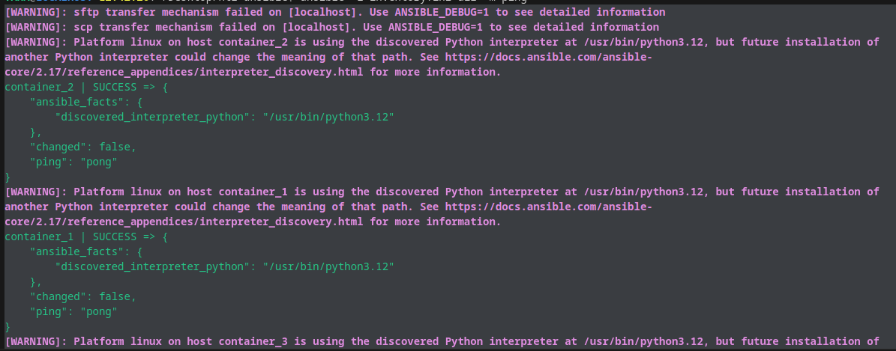
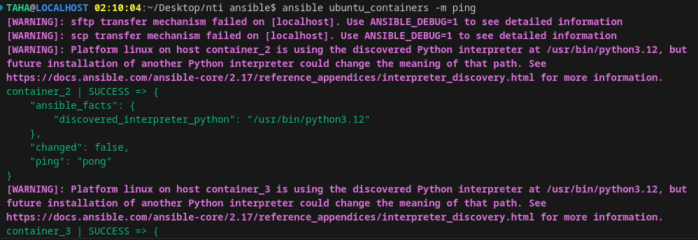

Got it! Let's expand your explanation to include the use of **Docker Compose** to run three containers with **SSHD** (SSH Daemon) running on each container, and how these containers can be used for training with Ansible. I'll also explain how the private key (`id_rsa`) is shared between the containers for SSH access and give a visual representation of the setup.

---

## **Day 1: Expanding Ansible Training with Docker Compose and SSH**

### **Objective:**
Learn how to use **Docker Compose** to launch multiple containers, configure **SSHD** on each container, and then manage these containers with **Ansible** using a shared **private key** for SSH authentication.

---

### **1. What is Docker Compose?**

**Docker Compose** is a tool for defining and running multi-container Docker applications. You use a `docker-compose.yml` file to configure the services, networks, and volumes required for your application, which in this case will be a set of containers running **SSH Daemon (SSHD)**.

With Docker Compose, you can easily start, stop, and manage multiple containers as a single application. This makes it ideal for testing multi-container setups, like the one you're doing with Ansible.

---

### **2. Docker Compose Setup for SSH Containers**

Let's start by defining a **Docker Compose configuration** that will create three containers with **SSHD** running in each. These containers will be able to communicate with each other via SSH using the same private key (`id_rsa`).

#### **docker-compose.yml:**

```yaml
version: '3'
services:
  ubuntu_sshd_1:
    build: .
    container_name: ubuntu_sshd_1
    tty: True
    ports:
      - "2221:22"

  ubuntu_sshd_2:
    build: .
    container_name: ubuntu_sshd_2
    tty: True
    ports:
      - "2222:22"

  ubuntu_sshd_3:
    build: .
    container_name: ubuntu_sshd_3
    tty: True
    ports:
      - "2223:22"
```
#### **dockerfile:**

```dockerfile
# Use the official Ubuntu image as the base image
FROM ubuntu:latest

# Set environment variable to non-interactive to avoid installation prompts
ENV DEBIAN_FRONTEND=noninteractive

# Update the package list and install openssh-server
RUN apt-get update && \
    apt-get install -y openssh-server && \
    mkdir /var/run/sshd

# Set a root password for SSH access (optional)
RUN echo 'root:root' | chpasswd

# Create the .ssh directory for the root user and set proper permissions
RUN mkdir -p /root/.ssh && chmod 700 /root/.ssh

# Copy the SSH public key into the authorized_keys file for root
COPY id_rsa.pub /root/.ssh/authorized_keys

# Set proper permissions for the authorized_keys file
RUN chmod 600 /root/.ssh/authorized_keys

# Copy the custom sshd_config file into the container
COPY sshd_config /etc/ssh/sshd_config

# Expose SSH port
EXPOSE 22

# Start SSH service when the container runs
CMD ["/usr/sbin/sshd", "-D"]

```


### **3. SSH Setup: Sharing the Private Key Across Containers**

For the containers to accept SSH connections from your Ansible machine, you need to set up SSH key-based authentication. The **private key** (`id_rsa`) is stored on the host machine and shared with each container. Here's how it works:

1. **Private Key (`id_rsa`)**: This key is mounted into each container's `/root/.ssh/` directory. It's used to authenticate SSH connections.
  
2. **Authorized Keys (`authorized_keys`)**: This file holds the public keys that are authorized to log in. The public key corresponding to your `id_rsa` private key should be added to this file in each container. This allows the containers to accept SSH connections from your Ansible control machine.

**Note**: In this setup, you're using **passwordless SSH** based on the shared private key, so each container will allow SSH login from your Ansible machine without requiring a password.

---

Here’s a more organized and refined version of your explanation, which provides a clear structure while keeping all the important steps intact:

---

### **4. Building and Running the Containers**

Now that you've defined the `docker-compose.yml` file, it's time to build and start the containers.

#### 1. **Build and Start the Containers:**

To build and run the containers in one step, use the following command:

```bash
docker-compose up -d --build
```

**Explanation**:
- **`up`**: Starts the containers defined in the `docker-compose.yml` file.
- **`-d`**: Runs the containers in detached mode (in the background).
- **`--build`**: Builds the images from the `Dockerfile` (if needed) before starting the containers.

This command will:
- **Build the images** if they do not already exist or if the Dockerfile has changed.
- **Create the three containers** (`container_1`, `container_2`, `container_3`) and start them in the background.

#### 2. **Verify the Containers Are Running:**

To confirm that the containers have started successfully, run the following command:

```bash
docker ps
```

You should see output similar to this:

```bash
CONTAINER ID   IMAGE           COMMAND                  CREATED          STATUS          PORTS                  NAMES
abcd1234       ubuntu:latest   "/usr/sbin/sshd -D"      2 minutes ago    Up 2 minutes    0.0.0.0:2221->22/tcp   container_1
efgh5678       ubuntu:latest   "/usr/sbin/sshd -D"      2 minutes ago    Up 2 minutes    0.0.0.0:2222->22/tcp   container_2
ijkl91011      ubuntu:latest   "/usr/sbin/sshd -D"      2 minutes ago    Up 2 minutes    0.0.0.0:2223->22/tcp   container_3
```

- **`PORTS`**: Each container should be accessible through a different port (2221, 2222, 2223) on your localhost.

---

### **5. Verifying SSH Access**

Now that the containers are running, you can test SSH access to each container. Use the following commands from your **host machine** (or Ansible machine) to connect to each container:

```bash
sudo ssh -i id_rsa -p 2221 root@localhost  # Access container_1
sudo ssh -i id_rsa -p 2222 root@localhost  # Access container_2
sudo ssh -i id_rsa -p 2223 root@localhost  # Access container_3
```


If the connection is successful, you'll be logged into each container's shell, confirming that SSH access is working.

---

### **6. Integrating with Ansible**

With SSH access confirmed, you can now integrate these containers into Ansible for automation.

#### 1. **Create the Ansible Inventory File (`inventory.ini`):**

Update your Ansible inventory to include the SSH access details for each container. The `inventory.ini` file should look like this:

```ini
[ubuntu_containers]
container_1 ansible_host=localhost ansible_port=2221 ansible_user=root ansible_ssh_private_key_file=id_rsa
container_2 ansible_host=localhost ansible_port=2222 ansible_user=root ansible_ssh_private_key_file=id_rsa
container_3 ansible_host=localhost ansible_port=2223 ansible_user=root ansible_ssh_private_key_file=id_rsa
```

This file tells Ansible how to connect to the containers using SSH, specifying:
- **`ansible_host`**: The host to connect to (in this case, `localhost`).
- **`ansible_port`**: The SSH port for each container.
- **`ansible_user`**: The user to log in as (root in this case).
- **`ansible_ssh_private_key_file`**: The path to the private SSH key used for authentication.

#### 2. **Test Ansible Connectivity:**

You can test connectivity using Ansible's `ping` module. Run the following command:

```bash
ansible -i inventory.ini all -m ping
```

You should see output like this:

```bash
container_1 | SUCCESS | rc=0 >> {
    "ping": "pong"
}
container_2 | SUCCESS | rc=0 >> {
    "ping": "pong"
}
container_3 | SUCCESS | rc=0 >> {
    "ping": "pong"
}
```


This confirms that Ansible can successfully reach all three containers.


---


>[!NOTE]  
>**Ansible Command Format**  
>The general format of an Ansible command is:
>```bash
>ansible [target] -i [inventory_file] [group_or_host] -m [module] [options]
>```
>  
>Let’s break down each part of the command `ansible -i inventory.ini all -m ping`:
>
> ---
>
> #### **1. `ansible`**
>
>
>
>
>
>#### **2. `[target]` (or `[group_or_host]`)**
>
>  
>The target specifies which hosts or groups of hosts the command should apply to. In this case, the target is `all`, which means the command will be executed on **all hosts** listed in your inventory file. You can also target a specific host or group of hosts:
>
>  - `all`: Runs the command on all hosts defined in the inventory file.
>  - `container_1`: Runs the command only on `container_1`.
>  - `[ubuntu_containers]`: Runs the command only on hosts within the `ubuntu_containers` group.
>
>
>
> #### **3. `-i [inventory_file]`**
>
>  
>The `-i` flag specifies the **inventory file** that contains the list of hosts and their configurations. This file could be in `.ini`, `.yaml`, or other formats > supported by Ansible. In this example, `inventory.ini` is the inventory file being used.
>
>Example:
>```bash
>ansible -i inventory.ini all -m ping
>```
>This means Ansible will look at `inventory.ini` for the list of hosts to interact with.
>#### **4. `-m [module]`**
>
>  
>The `-m` flag specifies the **Ansible module** that you want to use to perform a task. Ansible modules are predefined tools for performing specific actions like checking connectivity, managing files, or installing packages.
>
>
>In this case, the `ping` module is used. The `ping` module checks if a host is reachable by sending a simple ping command. It does not actually ping the network but uses SSH to check if the host is up and can respond.
>
>Common modules include:
> - `ping`: Tests if the host is reachable via SSH.
> - `command`: Executes a command on the remote host.
> - `copy`: Copies files from the local machine to the remote host.
> - `apt`: Manages packages on Debian-based systems.
>
>
>
> #### **5. `[options]`**
>
>  
>Additional options or arguments can be provided after the module to specify further behavior. In the case of the `ping` module, no additional options are needed.
>
>For other modules like `command`, you can specify what command to run on the remote host using the `-a` (arguments) flag. For example, to run `uptime` on all hosts, you would do:
>```bash
>ansible all -i inventory.ini -m command -a "uptime"
>```
>
>
>
>### **Putting It All Together**
>
>[!NOTE]  
>Now, let’s break down the specific command `ansible -i inventory.ini all -m ping`:
>
> - **`ansible`**: Executes the Ansible command.
> - **`-i inventory.ini`**: Specifies the inventory file `inventory.ini`, which contains your host configurations.
> - **`all`**: Indicates the command should apply to all hosts in the inventory file.
> - **`-m ping`**: Runs the `ping` module to check connectivity to all hosts.
>
>When you run this command, Ansible will try to "ping" each host listed in the `inventory.ini` file and check if the host is reachable.
>
> 
>
> ### ** of Ansible Command Format**
>
>[!NOTE]  
>Here are a few more examples of how the `ansible` command can be structured:
>
>1. **Run a Command on All Hosts:**
>   ```bash
>   ansible all -i inventory.ini -m command -a "uptime"
>   ```
>   - **`-m command`**: Runs the `command` module.
>   - **`-a "uptime"`**: Runs the `uptime` command on each host.
>
>2. **Run a Task on a Specific Group of Hosts:**
>   ```bash
>   ansible ubuntu_containers -i inventory.ini -m shell -a "df -h"
>   ```
>   - **`ubuntu_containers`**: Executes the command only on hosts within the `ubuntu_containers` group.
>   - **`-m shell`**: Uses the `shell` module to execute the `df -h` command.
>
> 3. **Run a Task on a Specific Host:**
>   ```bash
>   ansible container_1 -i inventory.ini -m copy -a "src=./file.txt dest=/tmp/file.txt"
>   ```
>   - **`container_1`**: Targets a specific host (`container_1`).
>   - **`-m copy`**: Uses the `copy` module to copy a file to the host.
>   - **`-a "src=./file.txt dest=/tmp/file.txt"`**: Specifies the source and destination paths.
>
>
>
> ### **Summary**
>
>[!NOTE]  
>In summary, the Ansible command `ansible -i inventory.ini all -m ping` follows this structure:
> ```bash
>ansible [target] -i [inventory_file] [group_or_host] -m [module] [options]
>```
>- **`target`**: The host or group of hosts you want to run the task on (`all`, `container_1`, `[ubuntu_containers]`).
>- **`-i`**: Specifies the inventory file.
>- **`-m`**: The module you want to use, like `ping`, `command`, or `copy`.
>- **`[options]`**: Additional arguments passed to the module (if required).
>
> The `ping` module is a simple way to test if the remote hosts are reachable via SSH. You can replace `ping` with other modules to perform different tasks on the hosts, such as running commands, managing files, and installing software.

---

This should give a clear explanation of the command with all relevant details enclosed in `>[!NOTE]` blocks!
> 
---

### **7. Visual Representation of the Setup**

Here’s a simple diagram to visualize the architecture of your setup:

```
+----------------+        +----------------+        +----------------+
|   Ansible     |        |   container_1  |        |   container_2  |
|   Control     | <----> |  (SSH Server)  | <----> |  (SSH Server)  |
|   Machine     |        |                |        |                |
| (localhost)   |        |  Port 2221     |        |  Port 2222     |
+----------------+        +----------------+        +----------------+
                             ^                        ^
                             |                        |
                             |                        |
                             |                        |
                             v                        v
                       +----------------+        +----------------+
                       |   container_3  |        |   Authorized   |
                       |  (SSH Server)  |        |     Keys       |
                       |                |        |    (Shared)    |
                       |  Port 2223     |        +----------------+
                       +----------------+
```

- **Ansible Control Machine**: This is where you run Ansible commands to manage the containers.
- **SSH Servers**: Each container runs an SSH service on a unique port (2221, 2222, 2223).
- **Private Key (`id_rsa`)**: The private key is used to authenticate SSH access.
- **Authorized Keys**: The corresponding public key is stored in each container to allow access.

---

Certainly! Let’s go through the process of how Ansible searches for and loads its **configuration file (`ansible.cfg`)**, and explain the order in which it looks for the file, from environment variables to system-wide settings.

---

### **8. Next Steps: Configuration with `ansible.cfg`**

In this section, we'll discuss how Ansible finds and loads its configuration file (`ansible.cfg`), which defines various settings like inventory paths, module paths, connection settings, and other important configurations. We'll also explain the search order, from environment variables to global system configurations.

---

#### **1. Understanding `ansible.cfg`**

>[!NOTE]  
>The `ansible.cfg` file is the configuration file that Ansible uses to customize its behavior. It allows you to define settings such as:
> - Default inventory location
> - Remote user settings
> - SSH arguments
> - Retry and log file settings
> - And more...

> **Note**: If you don't provide an `ansible.cfg` file, Ansible will use default settings, but you can customize them by creating and configuring the file.

---

#### **2. Location of `ansible.cfg`**

Ansible looks for the `ansible.cfg` file in a specific order. It starts by checking the environment variables, then moves through several directories to locate a configuration file. Ansible stops searching once it finds the first configuration file.

### **Search Order for `ansible.cfg`**

1. **Environment Variable (`ANSIBLE_CONFIG`)**:
   - Ansible first checks if the environment variable `ANSIBLE_CONFIG` is set. If it is, Ansible will use the path specified by this environment variable.
   - **Example**:  
     If the environment variable is set like this:
     ```bash
     export ANSIBLE_CONFIG=/path/to/your/ansible.cfg
     ```
     Ansible will use this configuration file directly.

2. **Current Directory (`./ansible.cfg`)**:
   - If the environment variable is not set, Ansible looks for an `ansible.cfg` file in the **current working directory** (i.e., the directory from which the Ansible command is being run).
   - **Example**:  
     If you have a project directory, you might place `ansible.cfg` there:
     ```bash
     /home/user/my_project/ansible.cfg
     ```

3. **User’s Home Directory (`~/.ansible.cfg`)**:
   - If Ansible does not find a configuration file in the current directory, it will then search the user’s home directory for `~/.ansible.cfg`.
   - **Example**:  
     The file would be located at:
     ```bash
     /home/user/.ansible.cfg
     ```

4. **System-wide Configuration (`/etc/ansible/ansible.cfg`)**:
   - If no configuration file is found in the previous locations, Ansible will fall back to the **global configuration file** located at `/etc/ansible/ansible.cfg`.
   - **Example**:  
     On Linux or macOS, this file might be located at:
     ```bash
     /etc/ansible/ansible.cfg
     ```

---

### **3. Ansible Configuration File Structure**

>[!NOTE]  
>The `ansible.cfg` file is written in **INI** format, which consists of sections and key-value pairs. Below is an example structure of an `ansible.cfg` file:

```ini
[defaults]

# Default location for the inventory file
inventory = /home/user/inventory.ini
# or
# inventory = /home/user/inventory.ini:/home/user/dev_inventory.ini:/home/user/prod_inventory.ini
# Default remote user for all hosts
remote_user = root
#stop fingerprints
# host_key_checking = False
# SSH arguments
ssh_args = -o ControlMaster=auto -o ControlPersist=60s

# Timeout for connections
timeout = 30

# Default location for storing the log files
log_path = /home/user/ansible.log

# Retry failed tasks automatically
retry_files_enabled = True

[privilege_escalation]
# Use sudo to escalate privileges on remote machines
become = True
become_method = sudo
become_user = root
```

### **Key Sections in `ansible.cfg`:**
- **[defaults]**: Contains default configuration values such as inventory file location, user settings, log path, and other global settings.
- **[privilege_escalation]**: Defines settings for privilege escalation (e.g., `sudo`), which is useful when you need to run commands as a different user on the remote hosts.
- **[inventory]**: Configuration for inventory plugins or specific inventory file locations (optional).
- **[ssh_connection]**: Configuration for SSH connection parameters, including timeout and SSH arguments.

---

### **4. Example: How Ansible Finds `ansible.cfg`**

Let’s assume the following scenario where Ansible is running and looking for its configuration file:

- **Environment Variable**: The environment variable `ANSIBLE_CONFIG` is **not set**.
- **Current Directory**: There is **no `ansible.cfg`** file in the current directory.
- **User’s Home Directory**: The file **`~/.ansible.cfg`** exists.
- **System-wide Configuration**: The file **`/etc/ansible/ansible.cfg`** exists but will be ignored since the user-specific configuration is found first.

**Result**: Ansible will use the configuration in the user's home directory (`~/.ansible.cfg`) and ignore the system-wide configuration file.

---

### **5. Example: Customizing `ansible.cfg`**

Here’s a typical example where you might want to configure some options in your `ansible.cfg`:

```ini
[defaults]
inventory = ./inventory.ini
remote_user = root
timeout = 10
```

In this example:
- **Inventory file** is specified to point to `./inventory.ini`.
- **Remote user** is set to `root`, meaning all Ansible commands will use this user to connect to hosts unless overridden.
- **Timeout** for SSH connections is set to 10 seconds.

---

### **6. Recap and Next Steps**

