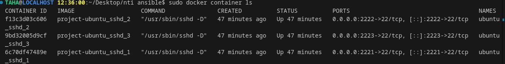

Got it! Let's expand your explanation to include the use of **Docker Compose** to run three containers with **SSHD** (SSH Daemon) running on each container, and how these containers can be used for training with Ansible. I'll also explain how the private key (`id_rsa`) is shared between the containers for SSH access and give a visual representation of the setup.

---

## **Day 1: Expanding Ansible Training with Docker Compose and SSH**

### **Objective:**
Learn how to use **Docker Compose** to launch multiple containers, configure **SSHD** on each container, and then manage these containers with **Ansible** using a shared **private key** for SSH authentication.

---

### **1. What is Docker Compose?**

**Docker Compose** is a tool for defining and running multi-container Docker applications. You use a `docker-compose.yml` file to configure the services, networks, and volumes required for your application, which in this case will be a set of containers running **SSH Daemon (SSHD)**.

With Docker Compose, you can easily start, stop, and manage multiple containers as a single application. This makes it ideal for testing multi-container setups, like the one you're doing with Ansible.

---

### **2. Docker Compose Setup for SSH Containers**

Let's start by defining a **Docker Compose configuration** that will create three containers with **SSHD** running in each. These containers will be able to communicate with each other via SSH using the same private key (`id_rsa`).

#### **docker-compose.yml:**

```yaml
version: '3'
services:
  ubuntu_sshd_1:
    build: .
    container_name: ubuntu_sshd_1
    tty: True
    ports:
      - "2221:22"

  ubuntu_sshd_2:
    build: .
    container_name: ubuntu_sshd_2
    tty: True
    ports:
      - "2222:22"

  ubuntu_sshd_3:
    build: .
    container_name: ubuntu_sshd_3
    tty: True
    ports:
      - "2223:22"
```
#### **dockerfile:**

```dockerfile
# Use the official Ubuntu image as the base image
FROM ubuntu:latest

# Set environment variable to non-interactive to avoid installation prompts
ENV DEBIAN_FRONTEND=noninteractive

# Update the package list and install openssh-server
RUN apt-get update && \
    apt-get install -y openssh-server && \
    mkdir /var/run/sshd

# Set a root password for SSH access (optional)
RUN echo 'root:root' | chpasswd

# Create the .ssh directory for the root user and set proper permissions
RUN mkdir -p /root/.ssh && chmod 700 /root/.ssh

# Copy the SSH public key into the authorized_keys file for root
COPY id_rsa.pub /root/.ssh/authorized_keys

# Set proper permissions for the authorized_keys file
RUN chmod 600 /root/.ssh/authorized_keys

# Copy the custom sshd_config file into the container
COPY sshd_config /etc/ssh/sshd_config

# Expose SSH port
EXPOSE 22

# Start SSH service when the container runs
CMD ["/usr/sbin/sshd", "-D"]

```


### **3. SSH Setup: Sharing the Private Key Across Containers**

For the containers to accept SSH connections from your Ansible machine, you need to set up SSH key-based authentication. The **private key** (`id_rsa`) is stored on the host machine and shared with each container. Here's how it works:

1. **Private Key (`id_rsa`)**: This key is mounted into each container's `/root/.ssh/` directory. It's used to authenticate SSH connections.
  
2. **Authorized Keys (`authorized_keys`)**: This file holds the public keys that are authorized to log in. The public key corresponding to your `id_rsa` private key should be added to this file in each container. This allows the containers to accept SSH connections from your Ansible control machine.

**Note**: In this setup, you're using **passwordless SSH** based on the shared private key, so each container will allow SSH login from your Ansible machine without requiring a password.

---

### **4. Building and Running the Containers**

Now that you've defined the `docker-compose.yml` file, let's build and start the containers.

1. **Build and Start the Containers:**

   ```bash
    docker-compose up -d --build

    
   ```

   This command will:
   - Pull the necessary images (e.g., `ubuntu:latest`).
   - Create the three containers (`container_1`, `container_2`, `container_3`).
   - Start the containers in detached mode (`-d`).

2. **Verify the Containers are Running:**

   To check that your containers are up and running:

   ```bash
   docker ps
   ```

   You should see something like this:

   ```bash
   CONTAINER ID   IMAGE          COMMAND                  CREATED          STATUS          PORTS                  NAMES
   abcd1234       ubuntu:latest  "/usr/sbin/sshd -D"      2 minutes ago    Up 2 minutes    0.0.0.0:2221->22/tcp   container_1
   efgh5678       ubuntu:latest  "/usr/sbin/sshd -D"      2 minutes ago    Up 2 minutes    0.0.0.0:2222->22/tcp   container_2
   ijkl91011      ubuntu:latest  "/usr/sbin/sshd -D"      2 minutes ago    Up 2 minutes    0.0.0.0:2223->22/tcp   container_3
   ```
   

    
   The `PORTS` column should show that each container is accessible on different ports (2221, 2222, and 2223) on your localhost.

---

### **5. Verifying SSH Access**

Now that the containers are running, you can verify SSH access from your host machine (or your Ansible machine) by connecting to each container manually:

```bash
sudo ssh -i id_rsa -p 2221 root@localhost
sudo ssh -i id_rsa -p 2222 root@localhost
sudo ssh -i id_rsa -p 2223 root@localhost
```


If the SSH connection works correctly, you'll be able to access the containers' shell.

---

### **6. Integrating with Ansible**

Now that your containers are running SSH services, and you can SSH into them, it's time to integrate them into Ansible for automation.

1. **Create the Ansible Inventory File (`inventory.ini`):**

   As mentioned earlier, your inventory file should now include the new SSH ports:

   ```ini
   [ubuntu_containers]
   container_1 ansible_host=localhost ansible_port=2221 ansible_user=root ansible_ssh_private_key_file=id_rsa
   container_2 ansible_host=localhost ansible_port=2222 ansible_user=root ansible_ssh_private_key_file=id_rsa
   container_3 ansible_host=localhost ansible_port=2223 ansible_user=root ansible_ssh_private_key_file=id_rsa
   ```

2. **Test Ansible Connectivity:**

   Run the following Ansible command to check if you can reach all the containers:

   ```bash
   ansible -i inventory.ini all -m ping
   ```

   You should see a response like this:

   ```bash
   container_1 | SUCCESS | rc=0 >> {
       "ping": "pong"
   }
   container_2 | SUCCESS | rc=0 >> {
       "ping": "pong"
   }
   container_3 | SUCCESS | rc=0 >> {
       "ping": "pong"
   }
   ```

---

### **7. Visual Representation of the Setup**

To summarize, here's a simple diagram to show the architecture:

```
+----------------+        +----------------+        +----------------+
|   Ansible     |        |   container_1  |        |   container_2  |
|   Control     | <----> |  (SSH Server)  | <----> |  (SSH Server)  |
|   Machine     |        |                |        |                |
| (localhost)   |        |  Port 2221     |        |  Port 2222     |
+----------------+        +----------------+        +----------------+
                             ^                        ^
                             |                        |
                             |                        |
                             |                        |
                             v                        v
                       +----------------+        +----------------+
                       |   container_3  |        |   Authorized   |
                       |  (SSH Server)  |        |     Keys       |
                       |                |        |    (Shared)    |
                       |  Port 2223     |        +----------------+
                       +----------------+
```

- **Ansible Control Machine**: This is where you will run Ansible commands to manage your containers.
- **SSH Servers**: Each

 container runs an SSH service, allowing you to connect via different ports (2221, 2222, 2223).
- **Private Key (`id_rsa`)**: The private key is mounted into each container to enable SSH access.
- **Authorized Keys**: The corresponding public key is stored in each container to allow SSH access from the Ansible machine.

---

### **8. Recap and Next Steps**

By the end of Day 1, you have successfully:
1. Set up multiple containers using Docker Compose, each running an SSH server.
2. Configured SSH key-based authentication to allow communication between your Ansible machine and containers.
3. Created an Ansible inventory and tested connectivity with the `ping` module.

#### **Next Steps**:
1. Explore how to automate tasks (like installing software, copying files, etc.) using Ansible playbooks on these containers.
2. Learn how to manage more complex infrastructure using Docker Compose with additional services.

Let me know if you’d like to dive deeper into any specific part!