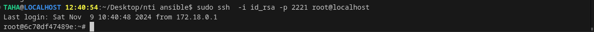

## **Day 1: Expanding Ansible Training with Docker Compose and SSH**

### **1. Docker Compose Setup for SSH Containers**

Let's start by defining a **Docker Compose configuration** that will create three containers with **SSHD** running in each. These containers will be able to communicate with each other via SSH using the same private key (`id_rsa`).

#### **docker-compose.yml:**

```yaml
version: '3'
services:
  ubuntu_sshd_1:
    build: .
    container_name: ubuntu_sshd_1
    tty: True
    ports:
      - "2221:22"

  ubuntu_sshd_2:
    build: .
    container_name: ubuntu_sshd_2
    tty: True
    ports:
      - "2222:22"

  ubuntu_sshd_3:
    build: .
    container_name: ubuntu_sshd_3
    tty: True
    ports:
      - "2223:22"
```
#### **dockerfile:**

```dockerfile
# Use the official Ubuntu image as the base image
FROM ubuntu:latest

# Set environment variable to non-interactive to avoid installation prompts
ENV DEBIAN_FRONTEND=noninteractive

# Update the package list and install openssh-server
RUN apt-get update && \
    apt-get install -y openssh-server sudo && \
    mkdir /var/run/sshd

# Set a root password for SSH access (optional)
RUN echo 'root:root' | chpasswd

# Create the .ssh directory for the root user and set proper permissions
RUN mkdir -p /root/.ssh && chmod 700 /root/.ssh

# Copy the SSH public key into the authorized_keys file for root
COPY id_rsa.pub /root/.ssh/authorized_keys

# Set proper permissions for the authorized_keys file
RUN chmod 600 /root/.ssh/authorized_keys

# Create the new user (nti) and add to sudo group (optional, if needed)
RUN useradd -m -s /bin/bash nti && \
    echo 'nti:nti' | chpasswd && \
    usermod -aG sudo nti

# Create the .ssh directory for the new user and set proper permissions
RUN mkdir -p /home/nti/.ssh && chmod 700 /home/nti/.ssh

# Copy the SSH public key into the authorized_keys file for the new user
COPY id_rsa.pub /home/nti/.ssh/authorized_keys

# Set proper permissions for the authorized_keys file
RUN chmod 600 /home/nti/.ssh/authorized_keys

# Set proper permissions for the home directory
RUN chown -R nti:nti /home/nti

# Copy the custom sshd_config file into the container
COPY sshd_config /etc/ssh/sshd_config

# Expose SSH port
EXPOSE 22

# Start SSH service when the container runs
CMD ["/usr/sbin/sshd", "-D"]


```


### **3. SSH Setup: Sharing the Private Key Across Containers**

For the containers to accept SSH connections from your Ansible machine, you need to set up SSH key-based authentication. The **private key** (`id_rsa`) is stored on the host machine and shared with each container. Here's how it works:

1. **Private Key (`id_rsa`)**: This key is mounted into each container's `/root/.ssh/` directory. It's used to authenticate SSH connections.
  
2. **Authorized Keys (`authorized_keys`)**: This file holds the public keys that are authorized to log in. The public key corresponding to your `id_rsa` private key should be added to this file in each container. This allows the containers to accept SSH connections from your Ansible control machine.

**Note**: In this setup, you're using **passwordless SSH** based on the shared private key, so each container will allow SSH login from your Ansible machine without requiring a password.

---

Here’s a more organized and refined version of your explanation, which provides a clear structure while keeping all the important steps intact:

---

### **4. Building and Running the Containers**

Now that you've defined the `docker-compose.yml` file, it's time to build and start the containers.

#### 1. **Build and Start the Containers:**

To build and run the containers in one step, use the following command:

```bash
docker-compose up -d --build
```

**Explanation**:
- **`up`**: Starts the containers defined in the `docker-compose.yml` file.
- **`-d`**: Runs the containers in detached mode (in the background).
- **`--build`**: Builds the images from the `Dockerfile` (if needed) before starting the containers.

This command will:
- **Build the images** if they do not already exist or if the Dockerfile has changed.
- **Create the three containers** (`container_1`, `container_2`, `container_3`) and start them in the background.

#### 2. **Verify the Containers Are Running:**

To confirm that the containers have started successfully, run the following command:

```bash
docker ps
```

You should see output similar to this:

```bash
CONTAINER ID   IMAGE           COMMAND                  CREATED          STATUS          PORTS                  NAMES
abcd1234       ubuntu:latest   "/usr/sbin/sshd -D"      2 minutes ago    Up 2 minutes    0.0.0.0:2221->22/tcp   container_1
efgh5678       ubuntu:latest   "/usr/sbin/sshd -D"      2 minutes ago    Up 2 minutes    0.0.0.0:2222->22/tcp   container_2
ijkl91011      ubuntu:latest   "/usr/sbin/sshd -D"      2 minutes ago    Up 2 minutes    0.0.0.0:2223->22/tcp   container_3
```

- **`PORTS`**: Each container should be accessible through a different port (2221, 2222, 2223) on your localhost.

---

### **5. Verifying SSH Access**

Now that the containers are running, you can test SSH access to each container. Use the following commands from your **host machine** (or Ansible machine) to connect to each container:

```bash
sudo ssh -i id_rsa -p 2221 root@localhost  # Access container_1 or nti@localhost    
sudo ssh -i id_rsa -p 2222 root@localhost  # Access container_2 or nti@localhost
sudo ssh -i id_rsa -p 2223 root@localhost  # Access container_3 or nti@localhost
```


If the connection is successful, you'll be logged into each container's shell, confirming that SSH access is working.

> [!NOTE]
>
> ```bash
> cat ~/.ssh/id_rsa.pub | ssh -p 2222 root@localhost 'mkdir -p ~/.ssh && cat >> ~/.ssh/authorized_keys'
> cat ~/.ssh/id_rsa.pub | ssh -p 2223 root@localhost 'mkdir -p ~/.ssh && cat >> ~/.ssh/authorized_keys'
> cat ~/.ssh/id_rsa.pub | ssh -p 2221 root@localhost 'mkdir -p ~/.ssh && cat >> ~/.ssh/authorized_keys'
> ```
>
> 


---

### **6. Integrating with Ansible**

With SSH access confirmed, you can now integrate these containers into Ansible for automation.

#### 1. **Create the Ansible Inventory File (`inventory.ini`):**

Update your Ansible inventory to include the SSH access details for each container. The `inventory.ini` file should look like this:

```ini
[ubuntu_containers]
container_1 ansible_host=localhost ansible_port=2221 ansible_user=nti ansible_ssh_private_key_file=id_rsa
container_2 ansible_host=localhost ansible_port=2222 ansible_user=nti ansible_ssh_private_key_file=id_rsa
container_3 ansible_host=localhost ansible_port=2223 ansible_user=nti ansible_ssh_private_key_file=id_rsa
```

This file tells Ansible how to connect to the containers using SSH, specifying:
- **`ansible_host`**: The host to connect to (in this case, `localhost`).
- **`ansible_port`**: The SSH port for each container.
- **`ansible_user`**: The user to log in as (root in this case).
- **`ansible_ssh_private_key_file`**: The path to the private SSH key used for authentication.

#### 2. **Test Ansible Connectivity:**

You can test connectivity using Ansible's `ping` module. Run the following command:

```bash
ansible -i inventory.ini all -m ping
```

You should see output like this:

```bash
container_1 | SUCCESS | rc=0 >> {
    "ping": "pong"
}
container_2 | SUCCESS | rc=0 >> {
    "ping": "pong"
}
container_3 | SUCCESS | rc=0 >> {
    "ping": "pong"
}
```


This confirms that Ansible can successfully reach all three containers.


---


>[!NOTE]  
>**Ansible Command Format**  
>The general format of an Ansible command is:
>```bash
>ansible [target] -i [inventory_file] [group_or_host] -m [module] [options]
>```
>  
>Let’s break down each part of the command `ansible -i inventory.ini all -m ping`:
>
> ---
>
> #### **1. `ansible`**
>
>
>
>
>
>#### **2. `[target]` (or `[group_or_host]`)**
>
>  
>The target specifies which hosts or groups of hosts the command should apply to. In this case, the target is `all`, which means the command will be executed on **all hosts** listed in your inventory file. You can also target a specific host or group of hosts:
>
>  - `all`: Runs the command on all hosts defined in the inventory file.
>  - `container_1`: Runs the command only on `container_1`.
>  - `[ubuntu_containers]`: Runs the command only on hosts within the `ubuntu_containers` group.
>
>
>
> #### **3. `-i [inventory_file]`**
>
>  
>The `-i` flag specifies the **inventory file** that contains the list of hosts and their configurations. This file could be in `.ini`, `.yaml`, or other formats > supported by Ansible. In this example, `inventory.ini` is the inventory file being used.
>
>Example:
>```bash
>ansible -i inventory.ini all -m ping
>```
>This means Ansible will look at `inventory.ini` for the list of hosts to interact with.
>#### **4. `-m [module]`**
>
>  
>The `-m` flag specifies the **Ansible module** that you want to use to perform a task. Ansible modules are predefined tools for performing specific actions like checking connectivity, managing files, or installing packages.
>
>
>In this case, the `ping` module is used. The `ping` module checks if a host is reachable by sending a simple ping command. It does not actually ping the network but uses SSH to check if the host is up and can respond.
>
>Common modules include:
> - `ping`: Tests if the host is reachable via SSH.
> - `command`: Executes a command on the remote host.
> - `copy`: Copies files from the local machine to the remote host.
> - `apt`: Manages packages on Debian-based systems.
>
>
>
> #### **5. `[options]`**
>
>  
>Additional options or arguments can be provided after the module to specify further behavior. In the case of the `ping` module, no additional options are needed.
>
>For other modules like `command`, you can specify what command to run on the remote host using the `-a` (arguments) flag. For example, to run `uptime` on all hosts, you would do:
>```bash
>ansible all -i inventory.ini -m command -a "uptime"
>```
>
>
>
>### **Putting It All Together**
>
>[!NOTE]  
>Now, let’s break down the specific command `ansible -i inventory.ini all -m ping`:
>
> - **`ansible`**: Executes the Ansible command.
> - **`-i inventory.ini`**: Specifies the inventory file `inventory.ini`, which contains your host configurations.
> - **`all`**: Indicates the command should apply to all hosts in the inventory file.
> - **`-m ping`**: Runs the `ping` module to check connectivity to all hosts.
>
>When you run this command, Ansible will try to "ping" each host listed in the `inventory.ini` file and check if the host is reachable.
>
> 
>
> ### ** of Ansible Command Format**
>
>[!NOTE]  
>Here are a few more examples of how the `ansible` command can be structured:
>
>1. **Run a Command on All Hosts:**
>   ```bash
>   ansible all -i inventory.ini -m command -a "uptime"
>   ```
>   - **`-m command`**: Runs the `command` module.
>   - **`-a "uptime"`**: Runs the `uptime` command on each host.
>
>2. **Run a Task on a Specific Group of Hosts:**
>   ```bash
>   ansible ubuntu_containers -i inventory.ini -m shell -a "df -h"
>   ```
>   - **`ubuntu_containers`**: Executes the command only on hosts within the `ubuntu_containers` group.
>   - **`-m shell`**: Uses the `shell` module to execute the `df -h` command.
>
> 3. **Run a Task on a Specific Host:**
>   ```bash
>   ansible container_1 -i inventory.ini -m copy -a "src=./file.txt dest=/tmp/file.txt"
>   ```
>   - **`container_1`**: Targets a specific host (`container_1`).
>   - **`-m copy`**: Uses the `copy` module to copy a file to the host.
>   - **`-a "src=./file.txt dest=/tmp/file.txt"`**: Specifies the source and destination paths.
>
>
>
> ### **Summary**
>
>[!NOTE]  
>In summary, the Ansible command `ansible -i inventory.ini all -m ping` follows this structure:
> ```bash
>ansible [target] -i [inventory_file] [group_or_host] -m [module] [options]
>```
>- **`target`**: The host or group of hosts you want to run the task on (`all`, `container_1`, `[ubuntu_containers]`).
>- **`-i`**: Specifies the inventory file.
>- **`-m`**: The module you want to use, like `ping`, `command`, or `copy`.
>- **`[options]`**: Additional arguments passed to the module (if required).
>
> The `ping` module is a simple way to test if the remote hosts are reachable via SSH. You can replace `ping` with other modules to perform different tasks on the hosts, such as running commands, managing files, and installing software.

---

This should give a clear explanation of the command with all relevant details enclosed in `>[!NOTE]` blocks!
> 
---

### **7. Visual Representation of the Setup**

Here’s a simple diagram to visualize the architecture of your setup:

```
+----------------+        +----------------+        +----------------+
|   Ansible     |        |   container_1  |        |   container_2  |
|   Control     | <----> |  (SSH Server)  | <----> |  (SSH Server)  |
|   Machine     |        |                |        |                |
| (localhost)   |        |  Port 2221     |        |  Port 2222     |
+----------------+        +----------------+        +----------------+
                             ^                        ^
                             |                        |
                             |                        |
                             |                        |
                             v                        v
                       +----------------+        +----------------+
                       |   container_3  |        |   Authorized   |
                       |  (SSH Server)  |        |     Keys       |
                       |                |        |    (Shared)    |
                       |  Port 2223     |        +----------------+
                       +----------------+
```

- **Ansible Control Machine**: This is where you run Ansible commands to manage the containers.
- **SSH Servers**: Each container runs an SSH service on a unique port (2221, 2222, 2223).
- **Private Key (`id_rsa`)**: The private key is used to authenticate SSH access.
- **Authorized Keys**: The corresponding public key is stored in each container to allow access.

---

Certainly! Let’s go through the process of how Ansible searches for and loads its **configuration file (`ansible.cfg`)**, and explain the order in which it looks for the file, from environment variables to system-wide settings.

---

### **8. Next Steps: Configuration with `ansible.cfg`**

In this section, we'll discuss how Ansible finds and loads its configuration file (`ansible.cfg`), which defines various settings like inventory paths, module paths, connection settings, and other important configurations. We'll also explain the search order, from environment variables to global system configurations.

---

#### **1. Understanding `ansible.cfg`**

>[!NOTE]  
>The `ansible.cfg` file is the configuration file that Ansible uses to customize its behavior. It allows you to define settings such as:
> - Default inventory location
> - Remote user settings
> - SSH arguments
> - Retry and log file settings
> - And more...

> **Note**: If you don't provide an `ansible.cfg` file, Ansible will use default settings, but you can customize them by creating and configuring the file.

---

#### **2. Location of `ansible.cfg`**

Ansible looks for the `ansible.cfg` file in a specific order. It starts by checking the environment variables, then moves through several directories to locate a configuration file. Ansible stops searching once it finds the first configuration file.

### **Search Order for `ansible.cfg`**

1. **Environment Variable (`ANSIBLE_CONFIG`)**:
   - Ansible first checks if the environment variable `ANSIBLE_CONFIG` is set. If it is, Ansible will use the path specified by this environment variable.
   - **Example**:  
     If the environment variable is set like this:
     ```bash
     export ANSIBLE_CONFIG=/path/to/your/ansible.cfg
     ```
     Ansible will use this configuration file directly.

2. **Current Directory (`./ansible.cfg`)**:
   - If the environment variable is not set, Ansible looks for an `ansible.cfg` file in the **current working directory** (i.e., the directory from which the Ansible command is being run).
   - **Example**:  
     If you have a project directory, you might place `ansible.cfg` there:
     ```bash
     /home/user/my_project/ansible.cfg
     ```

3. **User’s Home Directory (`~/.ansible.cfg`)**:
   - If Ansible does not find a configuration file in the current directory, it will then search the user’s home directory for `~/.ansible.cfg`.
   - **Example**:  
     The file would be located at:
     ```bash
     /home/user/.ansible.cfg
     ```

4. **System-wide Configuration (`/etc/ansible/ansible.cfg`)**:
   - If no configuration file is found in the previous locations, Ansible will fall back to the **global configuration file** located at `/etc/ansible/ansible.cfg`.
   - **Example**:  
     On Linux or macOS, this file might be located at:
     ```bash
     /etc/ansible/ansible.cfg
     ```

---

### **3. Ansible Configuration File Structure**

>[!NOTE]  
>The `ansible.cfg` file is written in **INI** format, which consists of sections and key-value pairs. Below is an example structure of an `ansible.cfg` file:

```ini
[defaults]

# Default location for the inventory file
inventory = /home/user/inventory.ini
# or
# inventory = /home/user/inventory.ini:/home/user/dev_inventory.ini:/home/user/prod_inventory.ini
# Default remote user for all hosts
remote_user = root
#stop fingerprints
# host_key_checking = False
# SSH arguments
ssh_args = -o ControlMaster=auto -o ControlPersist=60s

# Timeout for connections
timeout = 30

# Default location for storing the log files
log_path = /home/user/ansible.log

# Retry failed tasks automatically
retry_files_enabled = True

[privilege_escalation]
# Use sudo to escalate privileges on remote machines
become = True
become_method = sudo
become_user = root
```

### **Key Sections in `ansible.cfg`:**
- **[defaults]**: Contains default configuration values such as inventory file location, user settings, log path, and other global settings.
- **[privilege_escalation]**: Defines settings for privilege escalation (e.g., `sudo`), which is useful when you need to run commands as a different user on the remote hosts.
- **[inventory]**: Configuration for inventory plugins or specific inventory file locations (optional).
- **[ssh_connection]**: Configuration for SSH connection parameters, including timeout and SSH arguments.

---

### **4. Example: How Ansible Finds `ansible.cfg`**

Let’s assume the following scenario where Ansible is running and looking for its configuration file:

- **Environment Variable**: The environment variable `ANSIBLE_CONFIG` is **not set**.
- **Current Directory**: There is **no `ansible.cfg`** file in the current directory.
- **User’s Home Directory**: The file **`~/.ansible.cfg`** exists.
- **System-wide Configuration**: The file **`/etc/ansible/ansible.cfg`** exists but will be ignored since the user-specific configuration is found first.

**Result**: Ansible will use the configuration in the user's home directory (`~/.ansible.cfg`) and ignore the system-wide configuration file.

---

### **5. Example: Customizing `ansible.cfg`**

Here’s a typical example where you might want to configure some options in your `ansible.cfg`:

```ini
[defaults]
inventory = ./inventory.ini
remote_user = root
timeout = 10
```

In this example:
- **Inventory file** is specified to point to `./inventory.ini`.
- **Remote user** is set to `root`, meaning all Ansible commands will use this user to connect to hosts unless overridden.
- **Timeout** for SSH connections is set to 10 seconds.

---


### **7. Running Commands on Containers with Ansible**

In this section, we will explain how to run commands on the containers using Ansible, using the `command` module, and also how to run commands with elevated privileges (like `sudo`).

#### **Example: Running the `whoami` Command**

Let’s start by running the simple `whoami` command on the containers to identify the currently logged-in user. You can run the following command:

```bash
ansible ubuntu_containers -m command -a 'whoami'
```

##### **Explanation of the Command:**

- `ansible`: The command-line tool for executing Ansible commands.
- `ubuntu_containers`: This is the group of containers defined in the Ansible inventory file (e.g., containers in your `inventory.ini` file).
- `-m command`: The `-m` flag specifies the module to use. In this case, the `command` module is used to run shell commands.
- `-a 'whoami'`: The `-a` flag specifies the argument for the module. Here, `'whoami'` is the shell command we want to execute on each container.

##### **Sample Output:**

```bash
[WARNING]: sftp transfer mechanism failed on [localhost]. Use ANSIBLE_DEBUG=1 to see detailed information
[WARNING]: scp transfer mechanism failed on [localhost]. Use ANSIBLE_DEBUG=1 to see detailed information
[WARNING]: Platform linux on host container_2 is using the discovered Python interpreter at /usr/bin/python3.12, but
future installation of another Python interpreter could change the meaning of that path. See
https://docs.ansible.com/ansible-core/2.17/reference_appendices/interpreter_discovery.html for more information.
container_2 | CHANGED | rc=0 >>
root
[WARNING]: Platform linux on host container_1 is using the discovered Python interpreter at /usr/bin/python3.12, but
future installation of another Python interpreter could change the meaning of that path. See
https://docs.ansible.com/ansible-core/2.17/reference_appendices/interpreter_discovery.html for more information.
container_1 | CHANGED | rc=0 >>
root
[WARNING]: Platform linux on host container_3 is using the discovered Python interpreter at /usr/bin/python3.12, but
future installation of another Python interpreter could change the meaning of that path. See
https://docs.ansible.com/ansible-core/2.17/reference_appendices/interpreter_discovery.html for more information.
container_3 | CHANGED | rc=0 >>
root
```

##### **Explanation of the Output:**

1. **Warnings about `sftp` and `scp`:**
   - Ansible uses different mechanisms for transferring files between your local machine and remote machines. The warnings indicate that `sftp` and `scp` failed to transfer files between the control machine and the containers. These warnings can typically be ignored unless you're transferring files during your playbooks.

2. **Python Interpreter Warning:**
   - Ansible discovered the Python interpreter path (`/usr/bin/python3.12`) on each container. This warning is informational and tells you that future installations of Python on the host could alter the interpreter path, potentially causing issues with Python-based tasks. In most cases, this does not affect the execution of commands but is just a note.

3. **Result of the `whoami` Command:**
   - For each container (`container_1`, `container_2`, `container_3`), the output is as follows:
     - `CHANGED`: This indicates that the `whoami` command was executed, even though it doesn’t change anything on the container itself.
     - `rc=0`: This indicates that the command ran successfully without any errors.
     - `root`: This is the expected output of the `whoami` command, showing that the root user is executing the command in each container.

---

### **Running Commands with `sudo` (Privilege Escalation)**

Sometimes, you might need to run commands with elevated privileges (like `root` or using `sudo`). Ansible provides a feature called **Privilege Escalation** using the `become` directive. 

#### **Running Commands as `root` Using `sudo`:**

To run a command as `root`, you need to specify the `--become` flag (for privilege escalation). Here’s how you can run the `whoami` command as `root` using `sudo`:

```bash
ansible ubuntu_containers -m command -a 'whoami' --become --become-user=root
```

##### **Explanation of the Command:**

- `--become`: This flag tells Ansible to escalate privileges, similar to running `sudo`.
- `--become-user=root`: This specifies that the command should be run as the `root` user. By default, it runs as `root`, so this part is optional if you don't need to specify a different user.

#### **Why Use `--become`:**

Ansible will automatically use `sudo` for privilege escalation if you specify `--become`. This is useful if:
- You are running tasks that require root privileges (like installing packages, modifying system files, etc.).
- You want to ensure that the command runs as `root` even if the default user is non-root.

##### **Sample Output with `sudo`**

```bash
container_1 | SUCCESS | rc=0 >>
root
container_2 | SUCCESS | rc=0 >>
root
container_3 | SUCCESS | rc=0 >>
root
```

In this case:
- The output `SUCCESS` indicates that the command executed successfully on each container.
- `rc=0` means the command ran without errors.
- `root` is still the result of the `whoami` command, confirming that it was run with root privileges.

---


---


### **9. Privilege Escalation in Ansible**

When running tasks that require elevated privileges (e.g., installing packages, modifying system configurations), **Privilege Escalation** allows you to execute commands as a different user with higher permissions (typically `root`). 

In Ansible, privilege escalation is configured using the following settings:

#### **1. `become = True`**
This setting tells Ansible that it should **escalate privileges** when running commands. It is necessary when you want to run a task that requires higher privileges, such as system-level tasks (installing software, modifying system files, etc.).

- **Explanation**: When `become = True` is enabled, Ansible will use a method (like `sudo`) to run commands as a privileged user (e.g., `root`).

#### **2. `become_method = sudo`**
This setting specifies the method that Ansible should use to escalate privileges. In this case, it is set to `sudo`, which is the most common and secure method used in Unix-like systems to run commands with superuser privileges.

- **Explanation**: By default, Ansible uses `sudo` to escalate privileges. Other methods like `su` or `pfexec` can also be used depending on the system or security requirements.

#### **3. `become_user = root`**
This setting specifies which user Ansible should escalate to. Typically, it’s set to `root`, the superuser on Linux systems, but it can be changed to any other user with sufficient privileges.

- **Explanation**: This means that when privilege escalation occurs, the task will be executed as the `root` user (or any other user you specify).

#### **4. `become_ask_pass = True`**
When set to `True`, Ansible will **prompt you for the password** of the user being escalated to (e.g., `root`), ensuring that you authenticate the action.

- **Explanation**: This option is useful if you want an additional layer of security. Instead of automatically using `sudo` without prompting for the password, this option will ask you to enter the password interactively when you execute a playbook or command that requires privilege escalation.

- **Example**: If you are running a task that requires root privileges, you will be asked to provide the `root` password before Ansible can proceed.

#### **Complete Example of Privilege Escalation Settings:**

```ini
[privilege_escalation]
# Enable privilege escalation
become = True

# Use sudo as the method for privilege escalation
become_method = sudo

# Escalate to the root user
become_user = root

# Ask for password when escalating privileges (to root)
become_ask_pass = True
```
there are `ask_sudo_pass = True` but in `defaults` it ask you if your comand need sudo only
you add them if you didnot put them in inventory or want to change them for this satuation`--become --become-user=root'
---

#### **How Does This Work in Practice?**
```bash
ansible ubuntu_containers -m command -a "cat /etc/passwd"
```


# DAY 2 

In **Ansible playbooks**, modules are the building blocks that define the tasks you want to automate. Each module is essentially a unit of work, performing a specific action, like installing packages, copying files, or managing services. Understanding basic modules in Ansible playbooks is essential for writing effective automation scripts.

Here’s an explanation of some of the most common and basic Ansible modules you’ll often use in playbooks:

### 1. **`apt`** (Package Management for Debian-based systems)

- **Purpose**: Manages packages on **Debian**-based systems (like Ubuntu).

- **Common Use**: Installing, removing, or upgrading software packages.

  **Example**: Install or update a package:

  ```yaml
  - name: Install latest version of nginx
    apt:
      name: nginx
      state: latest
  ```

  **Explanation**:

  - `name`: The name of the package (e.g., `nginx`).
  - `state`: The desired state of the package. In this case, `latest` ensures the latest version is installed. Other states include `present` (installed) or `absent` (removed).

### 2. **`yum`** (Package Management for RedHat/CentOS-based systems)

- **Purpose**: Manages packages on **RedHat**-based systems (like CentOS or Fedora).

- **Common Use**: Installing, removing, or upgrading software packages on RHEL-based systems.

  **Example**: Install a package:

  ```yaml
  - name: Install latest version of nginx
    yum:
      name: nginx
      state: latest
  ```

  **Explanation**: Works similarly to the `apt` module, but for systems that use `yum` (or `dnf` in newer Fedora/CentOS systems).

### 3. **`copy`** (Copy files from the controller to the remote machine)

- **Purpose**: Copies files from the **Ansible controller** to the **remote target machine**.

- **Common Use**: Copying configuration files, scripts, or other resources to managed nodes.

  **Example**: Copy a local file to a remote server:

  ```yaml
  - name: Copy index.html to webserver
    copy:
      src: ./web/index.html
      dest: /var/www/html/index.html
      mode: '0644'
  ```

  **Explanation**:

  - `src`: Path to the source file on the controller machine.
  - `dest`: Path to the destination on the remote server.
  - `mode`: Sets the permissions on the file (in `chmod` style).

### 4. **`service`** (Manage services on remote nodes)

- **Purpose**: Ensures that services are started, stopped, restarted, or reloaded.

- **Common Use**: Managing services like `nginx`, `apache2`, `mysql`, etc.

  **Example**: Ensure a service is running:

  ```yaml
  - name: Ensure nginx is running
    service:
      name: nginx
      state: started
      enabled: yes
  ```

  **Explanation**:

  - `name`: The name of the service (e.g., `nginx`).
  - `state`: The desired state of the service (e.g., `started`, `stopped`, `restarted`).
  - `enabled`: Ensures the service is enabled to start at boot (`yes` or `no`).

### 5. **`file`** (Manage file and directory properties)

- **Purpose**: Manages file and directory properties, such as permissions, ownership, and whether they exist.

- **Common Use**: Setting file permissions, creating directories, ensuring files exist, etc.

  **Example**: Ensure a directory exists and has the correct permissions:

  ```yaml
  - name: Ensure the /var/www directory exists
    file:
      path: /var/www
      state: directory
      mode: '0755'
  ```

  **Explanation**:

  - `path`: The path to the file or directory.
  - `state`: Whether the item should exist as a directory or file (`directory`, `file`, `absent`).
  - `mode`: Sets the file or directory permissions.

### 6. **`command`** (Run a command on remote hosts)

- **Purpose**: Executes commands directly on the remote machine.

- **Common Use**: Running shell commands or scripts that don’t require the `sudo` privilege.

  **Example**: Run a shell command:

  ```yaml
  - name: Run a command on the remote host
    command: /usr/bin/uptime
  ```

  **Explanation**:

  - `command`: Runs the specified command on the remote system. It’s important to note that this module does not handle shell features like pipes (`|`) or redirects (`>`). For more complex shell operations, use the `shell` module.

### 7. **`shell`** (Run shell commands on remote hosts)

- **Purpose**: Similar to `command`, but allows for shell features like pipes and redirects.

- **Common Use**: Running more complex commands or shell scripts that need shell-specific features.

  **Example**: Run a command with a pipe:

  ```yaml
  - name: Check disk usage and output it to a file
    shell: df -h | tee /tmp/disk_usage.txt
  ```

  **Explanation**: The `shell` module allows for running shell commands with shell-specific features like pipes (`|`) and redirects (`>`).

### 8. **`get_url`** (Download files from a URL)

- **Purpose**: Downloads files from a URL to the target machine.

- **Common Use**: Downloading installation packages, files, or archives.

  **Example**: Download a file from the web:

  ```yaml
  - name: Download the latest release of nginx
    get_url:
      url: http://nginx.org/download/nginx-1.18.0.tar.gz
      dest: /tmp/nginx.tar.gz
  ```

  **Explanation**:

  - `url`: The URL of the file to download.
  - `dest`: The destination path where the file will be saved on the remote server.

### 9. **`user`** (Manage user accounts)

- **Purpose**: Manages user accounts on remote systems.

- **Common Use**: Creating, removing, or modifying users.

  **Example**: Create a new user:

  ```yaml
  - name: Create a new user
    user:
      name: johndoe
      state: present
      shell: /bin/bash
  ```

  **Explanation**:

  - `name`: The name of the user.
  - `state`: Whether the user should exist (`present`) or be removed (`absent`).
  - `shell`: The shell to assign to the user.

### 10. **`git`** (Manage Git repositories)

- **Purpose**: Manages Git repositories, cloning them or pulling updates.

- **Common Use**: Cloning repositories or pulling changes from remote repositories.

  **Example**: Clone a Git repository:

  ```yaml
  - name: Clone a repository
    git:
      repo: 'https://github.com/example/repo.git'
      dest: /home/user/repo
      clone: yes
  ```

  **Explanation**:

  - `repo`: The URL of the Git repository.
  - `dest`: The local directory where the repository will be cloned.
  - `clone: yes`: Ensures that the repository is cloned.

  ### 11. **`debug`** (Prints messages for debugging)

  - **Purpose**: The `debug` module is used to print messages, variables, or conditions during playbook execution. It helps in debugging and troubleshooting playbooks by displaying information that helps you understand what's happening at different points.

  - **Common Use**: Displaying values of variables, checking conditions, or printing custom messages during playbook execution.

  ---

  #### **Example 1: Print a simple message**

  ```yaml
  - name: Debug example
    hosts: localhost
    tasks:
      - name: Print a simple debug message
        debug:
          msg: "This is a debug message"
  ```

  **Explanation**:
  - The `debug` module prints the message `"This is a debug message"` to the output.

  **Output**:
  ```
  TASK [Print a simple debug message] *************************************
  ok: [localhost] => (item=None) =>
    msg: "This is a debug message"
  ```

  ---

  #### **Example 2: Print a variable**

  ```yaml
  - name: Debug variable example
    hosts: localhost
    vars:
      user_name: "John Doe"
    tasks:
      - name: Display the user_name variable
        debug:
          msg: "The username is {{ user_name }}"
  ```

  **Explanation**:
  - The `debug` module prints the value of the `user_name` variable to the output.

  **Output**:
  ```
  TASK [Display the user_name variable] ***********************************
  ok: [localhost] => (item=None) =>
    msg: "The username is John Doe"
  ```

  ---

  #### **Example 3: Print based on condition**

  ```yaml
  - name: Debugging conditional logic
    hosts: localhost
    vars:
      is_installed: true
    tasks:
      - name: Check if installed
        debug:
          msg: "The software is installed!"
        when: is_installed == true
  
      - name: Check if not installed
        debug:
          msg: "The software is not installed!"
        when: is_installed == false
  ```

  **Explanation**:
  - The first task will print `"The software is installed!"` if `is_installed` is `true`.
  - The second task will print `"The software is not installed!"` if `is_installed` is `false`.

  **Output**:
  ```
  TASK [Check if installed] ***********************************************
  ok: [localhost] => (item=None) =>
    msg: "The software is installed!"
  ```

  ---

  #### **Example 4: Debug complex data structures**

  ```yaml
  - name: Debug list and dictionary
    hosts: localhost
    vars:
      user_info:
        name: "John Doe"
        age: 30
        roles:
          - admin
          - user
    tasks:
      - name: Display user info dictionary
        debug:
          var: user_info
  
      - name: Display roles list
        debug:
          var: user_info.roles
  ```

  **Explanation**:
  - The `debug` module will print the entire `user_info` dictionary and then print only the `roles` list.

  **Output**:
  ```
  TASK [Display user info dictionary] *************************************
  ok: [localhost] => (item=None) =>
    user_info:
      name: John Doe
      age: 30
      roles:
        - admin
        - user
  
  TASK [Display roles list] ***********************************************
  ok: [localhost] => (item=None) =>
    user_info.roles:
      - admin
      - user
  ```

  ---

  ### **Summary**
  The `debug` module is a valuable tool in Ansible for printing information during playbook execution, which helps to troubleshoot, verify variable values, and control the flow based on conditions.

## LAB1

### **Playbook :*

```yaml
---
- name: Set up nginx on all webservers
  hosts: webserver
  become: yes  # Use sudo privileges if needed for tasks like installing packages or restarting services
  tasks:
    - name: Update apt cache
      apt:
        update_cache: yes

    - name: Install latest nginx
      apt:
        name: nginx
        state: latest

    - name: Copy index.html to webserver
      copy:
        src: ./web/hi.html  # Change this to the correct path on your controller machine
        dest: /var/www/html/index.html
        mode: '0644'

    - name: Restart nginx service (SysVinit)
      service:
        name: nginx
        state: restarted
        enabled: yes

    - name: Ensure nginx is running (SysVinit)
      service:
        name: nginx
        state: started
        enabled: yes
```

> [!NOTE]
>
> `inventory file` 
>
> ```ini
> [ubuntu_containers]
> container_1 ansible_host=localhost ansible_port=2221 ansible_user=root ansible_ssh_private_key_file=id_rsa
> container_2 ansible_host=localhost ansible_port=2222 ansible_user=root ansible_ssh_private_key_file=id_rsa
> container_3 ansible_host=localhost ansible_port=2223 ansible_user=root ansible_ssh_private_key_file=id_rsa
> [webserver]
> container_1 ansible_host=localhost ansible_port=2221 ansible_user=root ansible_ssh_private_key_file=id_rsa
> ```
>
> 

---

### **Basic Task Syntax in Playbooks**:
Every task in a playbook generally follows this structure:

```yaml
- name: <task description>
  <module_name>:
    <module_options>
```

- **`name`**: A human-readable description of what the task does.
- **`module_name`**: The name of the Ansible module (e.g., `apt`, `copy`, `service`, etc.).
- **`module_options`**: The parameters or options required by the module to perform its task.

---

### **Conclusion:**
Modules are the fundamental building blocks in Ansible playbooks. They abstract complex tasks, allowing you to automate and manage various system functions with simple, declarative statements. The basic modules like `apt`, `copy`, `service`, `user`, `file`, and `command` can cover most common tasks you'll need when automating infrastructure.

Let me know if you'd like more details about a specific module or task!

#### **1. Play Definition:**
```yaml
- name: Set up nginx on all webservers
  hosts: webserver
  become: yes  # Use sudo privileges if needed for tasks like installing packages or restarting services
  tasks:
```

- `name`: This defines a descriptive name for the playbook. It helps in understanding the purpose of this playbook when running or debugging it.
- `hosts: webserver`: This specifies that the playbook will run on all hosts in the **`webserver`** group. This group is typically defined in your **Ansible inventory file** (e.g., `hosts` file or dynamic inventory).
- `become: yes`: This tells Ansible to use **sudo** privileges (or other privilege escalation mechanisms) to perform tasks that require root permissions, like installing packages or restarting services.

#### **2. Task 1: Update apt cache**
```yaml
- name: Update apt cache
  apt:
    update_cache: yes
```

- **Purpose**: Updates the **apt** package manager’s cache, ensuring that your system has the latest list of available packages.
- **Explanation**: Before installing any packages (in this case, Nginx), it is a good practice to refresh the local package index so that Ansible installs the most recent versions.

#### **3. Task 2: Install the latest version of Nginx**
```yaml
- name: Install latest nginx
  apt:
    name: nginx
    state: latest
```

- **Purpose**: Installs or updates **Nginx** to the latest version available in the system’s package repository.
- **Explanation**: The **`state: latest`** option ensures that Ansible will install Nginx if it’s not already installed, or upgrade it to the latest version if it's already present on the system.

#### **4. Task 3: Copy index.html to the webserver**
```yaml
- name: Copy index.html to webserver
  copy:
    src: ./web/hi.html  # Change this to the correct path on your controller machine
    dest: /var/www/html/index.html
    mode: '0644'
```

- **Purpose**: Copies an HTML file from your Ansible controller machine to the target webserver, placing it in the default Nginx web directory (`/var/www/html`).
- **Explanation**:
  - `src: ./web/hi.html`: The `src` refers to the location of the file on the **controller machine** (the machine running Ansible).
  - `dest: /var/www/html/index.html`: This is the target location on the **web server** where the `hi.html` file will be copied, replacing the default `index.html` file that Nginx serves.
  - `mode: '0644'`: Sets the file permissions for the copied file to `0644`, which means it’s readable by all users but writable only by the owner.

#### **5. Task 4: Restart nginx service (SysVinit)**
```yaml
- name: Restart nginx service (SysVinit)
  service:
    name: nginx
    state: restarted
    enabled: yes
```

- **Purpose**: Restarts the **Nginx** service to apply any configuration changes (such as if new packages were installed or if an update was performed).
- **Explanation**:
  - `state: restarted`: Ensures that the Nginx service is restarted. If it’s already running, it will be stopped and started again. This is often needed after installing or updating packages.
  - `enabled: yes`: Makes sure that the Nginx service is enabled to start automatically when the server reboots.

#### **6. Task 5: Ensure nginx is running**
```yaml
- name: Ensure nginx is running (SysVinit)
  service:
    name: nginx
    state: started
    enabled: yes
```

- **Purpose**: Ensures that the **Nginx** service is up and running, and that it is enabled to start on boot.
- **Explanation**:
  - `state: started`: Ensures that the Nginx service is currently running. If it’s not running, Ansible will start it.
  - `enabled: yes`: Ensures that the Nginx service will start automatically on system reboot.

---

## Tags

### **Explanation of Tags in Ansible**

In Ansible, **tags** are a powerful mechanism that allows you to control which tasks or parts of a playbook get executed. By assigning tags to tasks, you can selectively run or skip tasks based on specific criteria when you execute the playbook. This makes it possible to target specific actions without having to run the entire playbook.

Tags can be used to control the flow of execution in large and complex playbooks, enabling more efficient and modular automation.

---

### **What are Tags?**
Tags in Ansible are labels you assign to individual tasks, blocks, or plays within a playbook. Once a task is tagged, you can then run the playbook with the `--tags` option to execute only the tasks that are associated with those tags.

### **Why Use Tags?**
1. **Selective Task Execution**: You may want to run only certain parts of a playbook, for example, to test a specific configuration or run specific tasks on a particular host.
2. **Efficient Playbook Management**: When playbooks are large and contain many tasks, tags allow you to focus on specific tasks, like installation, configuration, or cleanup, without having to execute everything.
3. **Reusability**: Tags allow you to create reusable tasks that can be executed in different contexts with different playbooks, depending on the tags you pass.

---

### **Basic Syntax of Tags**

You can assign tags to individual tasks, blocks, or plays using the `tags` parameter. Here's the basic syntax:

```yaml
tasks:
  - name: Install nginx
    apt:
      name: nginx
      state: present
    tags:
      - install
      - webserver

  - name: Start nginx service
    service:
      name: nginx
      state: started
    tags:
      - start
      - webserver
```

In this example:
- The first task installs **nginx**, and it's tagged with `install` and `webserver`.
- The second task starts the **nginx service**, and it's tagged with `start` and `webserver`.

### **How to Run Playbooks with Tags**

When running the playbook, you can specify which tags to include using the `--tags` option. This will only execute the tasks associated with those tags.

For example:

```bash
ansible-playbook playbook.yml --tags install
```

This command will run only the tasks that are tagged with `install` (in this case, the `Install nginx` task).

You can specify multiple tags by separating them with commas:

```bash
ansible-playbook playbook.yml --tags "install,webserver"
```

This command will run all tasks that are tagged with either `install` or `webserver`.

Alternatively, you can exclude certain tags using `--skip-tags`:

```bash
ansible-playbook playbook.yml --skip-tags "start"
```

This will run all tasks except those tagged with `start`.

### **Tagging Different Components: Tasks, Blocks, and Plays**

You can apply tags not only to individual tasks but also to **blocks** or **plays**.

#### **1. Tags for Tasks**

Tags are most commonly used for tasks to control which steps in the playbook will run. For example:

```yaml
tasks:
  - name: Install nginx
    apt:
      name: nginx
      state: present
    tags:
      - install

  - name: Install Apache
    apt:
      name: apache2
      state: present
    tags:
      - install
      - webserver
```

Both tasks are tagged with `install`, so running:

```bash
ansible-playbook playbook.yml --tags install
```

will execute both `Install nginx` and `Install Apache`.

#### **2. Tags for Blocks**

You can also tag **blocks** of tasks. Blocks group tasks together, so if you tag the block, all tasks inside the block are affected.

```yaml
tasks:
  - block:
      - name: Install nginx
        apt:
          name: nginx
          state: present
      - name: Start nginx service
        service:
          name: nginx
          state: started
    tags:
      - webserver
```

If you run the playbook with `--tags webserver`, both tasks inside the block will be executed.

#### **3. Tags for Plays**

Tags can be applied to an entire play as well. When a play is tagged, all tasks within that play will be executed if the tag is provided.

```yaml
- name: Install and configure web servers
  hosts: webservers
  tags:
    - webserver
  tasks:
    - name: Install nginx
      apt:
        name: nginx
        state: present

    - name: Start nginx
      service:
        name: nginx
        state: started
```

If you run:

```bash
ansible-playbook playbook.yml --tags webserver
```

both tasks in the play will be executed because the play itself is tagged with `webserver`.

### **Advanced Usage of Tags**

#### **1. Combining Tags**

You can combine tags and run specific tasks that match any of the provided tags. For instance:

```bash
ansible-playbook playbook.yml --tags "install,configure"
```

This will execute all tasks tagged with either `install` **or** `configure`. It’s an **OR** logic between tags.

#### **2. Skipping Tasks Using `--skip-tags`**

You can also use `--skip-tags` to exclude certain tasks. For example, if you want to run everything except tasks tagged with `debug`, you would run:

```bash
ansible-playbook playbook.yml --skip-tags debug
```

This would run all tasks in the playbook except those that are tagged with `debug`.

### **Explaining `always` and `never` Tags with the `debug` Module in Ansible**

In Ansible, the `tags` feature is a powerful tool for controlling which tasks in a playbook get executed. When combined with the `debug` module, tags like `always` and `never` offer even more control over the execution flow. 

Let's dive into how these tags work, particularly when used in conjunction with the `debug` module, to display messages or variable values based on specific execution conditions.

### **What are `always` and `never` Tags?**

- **`always` Tag**: Ensures that a task is always executed, regardless of the success or failure of previous tasks.
- **`never` Tag**: Ensures that a task is never executed, regardless of other conditions or tags.

These tags are helpful in controlling critical tasks that should run in every case (`always`), or tasks that you want to avoid running entirely (`never`), regardless of the rest of the playbook's logic.

### **How to Use `always` and `never` with `debug`**

When you use the `debug` module, you can print out messages, variable values, or conditions to understand the flow of your playbook. By combining `always` and `never` with `debug`, you can control when certain debugging tasks should or should not run.

#### **1. `always` Tag with `debug` Module**

The `always` tag guarantees that the task will run no matter what, even if other tasks fail or are skipped. This can be useful when you want to ensure that certain cleanup or logging tasks are always executed.

##### **Example with `always` Tag:**

```yaml
---
- name: Always execute debug task
  hosts: localhost
  tasks:
    - name: Print debug message (always)
      debug:
        msg: "This task will always run."
      tags:
        - always

    - name: Print another debug message
      debug:
        msg: "This task will run only if 'debug' tag is passed."
      tags:
        - debug
```

#### **Explanation**:
- The first task is marked with the `always` tag, so it will always print the message **"This task will always run."** regardless of whether other tasks are skipped or fail.
- The second task will only be executed if you explicitly run the playbook with the `--tags debug` flag.

##### **Running the Playbook**:
If you run the playbook without any tags, both tasks will run. If you use `--tags debug`, only the second task will run, but the task with the `always` tag will still run regardless of what tags you specify.

```bash
ansible-playbook playbook.yml --tags debug
```

Output will include both:
- "This task will always run."
- "This task will run only if 'debug' tag is passed."

#### **2. `never` Tag with `debug` Module**

The `never` tag prevents a task from being executed under any circumstances. This can be useful if you want to explicitly ensure that certain tasks are ignored, regardless of any other conditions.

##### **Example with `never` Tag:**

```yaml
---
- name: Never execute debug task
  hosts: localhost
  tasks:
    - name: Print debug message (never)
      debug:
        msg: "This task will never run."
      tags:
        - never

    - name: Print another debug message (if not 'never')
      debug:
        msg: "This task will run unless 'never' is set."
      tags:
        - debug
```

#### **Explanation**:
- The first task is tagged with `never`. This means that **this task will never run**, even if you specify `--tags debug`.
- The second task will execute only if you run the playbook with the `--tags debug` flag.

##### **Running the Playbook**:
If you run the playbook without any tags, neither task will execute. If you use `--tags debug`, only the second task will run, and the task with the `never` tag will be skipped regardless of the conditions.

```bash
ansible-playbook playbook.yml --tags debug
```

Output will include:
- "This task will run unless 'never' is set."

#### **3. Combining `always` and `never` Tags**

You can combine `always` and `never` tags with other tags to gain more control over task execution. For example, you may want a specific cleanup task to always run at the end of the playbook, but prevent certain tasks from running based on the situation.

##### **Example with Both `always` and `never` Tags**:

```yaml
---
- name: Example with always and never tags
  hosts: localhost
  tasks:
    - name: Debug message always printed (always)
      debug:
        msg: "This message is always printed."
      tags:
        - always

    - name: Debug message that will never print (never)
      debug:
        msg: "This message should never print."
      tags:
        - never

    - name: Debug message printed only with 'install' tag
      debug:
        msg: "This message is printed only with 'install' tag."
      tags:
        - install
```

#### **Explanation**
##### **Running the Playbook**:
1. If you run the playbook **without tags**:
   - Only the first task will run because it is tagged with `always`.
2. If you run the playbook with `--tags install`:
   - The first and third tasks will run, but the second task with the `never` tag will be skipped.

```bash
ansible-playbook playbook.yml --tags install
```

### **Key Points about `always` and `never` Tags**:
- **`always`**: Ensures the task is executed no matter what. Useful for tasks like cleanup or logging that you always want to execute, regardless of the outcome of other tasks.
- **`never`**: Prevents the task from executing. It is useful when you need to explicitly prevent certain tasks from running, even if they are part of the playbook.

### **Combining Tags for More Control**
- You can use `always` and `never` alongside other tags to create highly flexible playbook executions. For instance, you can ensure that a certain task always runs, but allow others to be conditionally executed based on tags you specify at runtime.

### use varibles

Sure! Below are some examples that demonstrate how to use variables effectively in Ansible playbooks, specifically focusing on using the `debug` module to display variable values. These examples cover different scenarios, including simple variable usage, list manipulation, and using `set_fact` to dynamically set or combine variables.

---

### **1. Simple Variable Display with `debug`**

This is the most straightforward example where we define a variable and use the `debug` module to display its value.

#### Example:

```yaml
# playbook.yml
---
- name: Simple variable example
  hosts: localhost
  vars:
    our_name: "taha_samy"
  tasks:
    - name: Display the value of our_name
      debug:
        msg: "The value of our_name is: {{ our_name }}"
```

**Explanation:**
- We define the variable `our_name` with the value `"taha_samy"`.
- The `debug` task prints the value of `our_name`.

**Output Example:**
```
The value of our_name is: taha_samy
```

---

### **2. Working with Lists of Users**

This example demonstrates how to work with a list of users and how to use the `debug` module to print specific elements from the list.

#### Example:

```yaml
# playbook.yml
---
- name: List example with users
  hosts: localhost
  vars:
    users:
      - name: "ahmed"
        role: "admin"
      - name: "sara"
        role: "user"
  tasks:
    - name: Display all users
      debug:
        msg: "Users: {{ users }}"

    - name: Display the name of the first user
      debug:
        msg: "First user's name is: {{ users[0].name }}"
    
    - name: Display roles of all users
      debug:
        msg: "User {{ item.name }} has role {{ item.role }}"
      loop: "{{ users }}"
```

**Explanation:**
- We define a list of dictionaries in the `users` variable.
- The first debug task prints the entire `users` list.
- The second debug task prints the name of the first user (`ahmed`).
- The third task uses a loop to print the name and role of each user in the list.

**Output Example:**
```
Users: [{'name': 'ahmed', 'role': 'admin'}, {'name': 'sara', 'role': 'user'}]
First user's name is: ahmed
User ahmed has role admin
User sara has role user
```

---

### **3. Manipulating Lists with `set_fact`**

In this example, we manipulate the list of users by extracting their names and combining them into a single string using the `set_fact` module.

#### Example:

```yaml
# playbook.yml
---
- name: Manipulating lists with set_fact
  hosts: localhost
  vars:
    users:
      - name: "ahmed"
        role: "admin"
      - name: "sara"
        role: "user"
  tasks:
    - name: Create a comma-separated list of user names
      set_fact:
        users_list: "{{ users | map(attribute='name') | join(', ') }}"
    
    - name: Display the comma-separated list of user names
      debug:
        msg: "The list of user names: {{ users_list }}"
```

**Explanation:**
- We use `set_fact` to create a new variable `users_list` that combines the `name` attributes of the users in the `users` list into a single string, separated by commas.
- The `map(attribute='name')` function extracts the `name` field from each user, and `join(', ')` concatenates them into a comma-separated string.

**Output Example:**
```
The list of user names: ahmed, sara
```

---

### **4. Using Variables with Conditional Logic**

In this example, we demonstrate how to use variables in combination with Ansible's conditional logic to perform different tasks depending on the value of a variable.

#### Example:

```yaml
# playbook.yml
---
- name: Conditional logic with variables
  hosts: localhost
  vars:
    environment: "production"
  tasks:
    - name: Show message for production environment
      debug:
        msg: "This is a production environment."
      when: environment == "production"
    
    - name: Show message for non-production environment
      debug:
        msg: "This is not a production environment."
      when: environment != "production"
```

**Explanation:**
- We define a variable `environment` and set it to `"production"`.
- We use the `when` condition to display a message depending on whether the environment is production or not.

**Output Example:**
```
This is a production environment.
```

---

### **5. Using `set_fact` to Combine Variables Dynamically**

This example demonstrates how to dynamically create variables by combining other variables and display the result using the `debug` module.

#### Example:

```yaml
# playbook.yml
---
- name: Combining variables dynamically
  hosts: localhost
  vars:
    first_name: "Taha"
    last_name: "Samy"
  tasks:
    - name: Combine first and last names
      set_fact:
        full_name: "{{ first_name }} {{ last_name }}"
    
    - name: Display the full name
      debug:
        msg: "The full name is: {{ full_name }}"
```

**Explanation:**
- We define two variables, `first_name` and `last_name`.
- Using `set_fact`, we dynamically combine these two variables into a new variable `full_name`.
- We then display the `full_name` using the `debug` module.

**Output Example:**
```
The full name is: Taha Samy
```

---

### **6. Combining `debug` with Tags and Registering Outputs** with combined vars

In this example, we show how to register a task's output and use that in subsequent tasks, along with tags to filter tasks.

#### Example:

```yaml
# playbook.yml
---
- name: Using debug with register and tags
  hosts: localhost
  vars:
    our_name: "taha_samy"
    first: "taha"
    second: "samy"
  tasks:
    - name: First task with a debug message
      debug:
        msg: "This is a debug message for {{ our_name }}"
      register: debug_output
      tags:
        - always

    - name: Display registered output from previous task
      debug:
        msg: "The previous message was: {{ debug_output.msg }}"
      tags:
        - show_output
```

**Explanation:**
- We define a variable `our_name` and use it in the first `debug` task.
- We use the `register` keyword to capture the output of the first task into the `debug_output` variable.
- In the next task, we access `debug_output.msg` to display the message captured from the previous task.
- We use tags to organize and filter the tasks (`always` and `show_output`).

**Output Example:**
```
The previous message was: This is a debug message for taha_samy
```

---

### **7. Displaying the Value of a Dictionary Key**

This example shows how to access and print the value of a specific key from a dictionary using the `debug` module.

#### Example:

```yaml
# playbook.yml
---
- name: Display value of dictionary keys
  hosts: localhost
  vars:
    user_info:
      name: "ahmed"
      role: "admin"
  tasks:
    - name: Display user name
      debug:
        msg: "The user's name is: {{ user_info.name }}"

    - name: Display user role
      debug:
        msg: "The user's role is: {{ user_info.role }}"
```

**Explanation:**
- We define a dictionary variable `user_info` with `name` and `role` keys.
- The `debug` module accesses the values of `name` and `role` using `{{ user_info.name }}` and `{{ user_info.role }}`.

**Output Example:**
```
The user's name is: ahmed
The user's role is: admin
```


## playbook  and inventory  and command line levels

for playbook and command as we explained use tags in playbook and then use `--tags` or use `--skip-tags`with command

It seems you're trying to create an **Ansible inventory** file that organizes your hosts into multiple levels or groups, such as `all`, `webserver`, and potentially other groups like `database`, `loadbalancer`, etc. You can define different levels of groups and even nested groups, which allows you to target specific sets of hosts during your Ansible runs.

Let me walk you through some **inventory examples** that demonstrate multilevel (nested) groups, as well as more complex configurations.

### **Basic Inventory with Multilevel Grouping**

#### Example 1: **Simple Inventory with Groups and Nested Groups**

This example shows how you can create basic and nested groups in your inventory file. We'll use `all`, `webserver`, and `database` groups.

```ini
[all]
container_1 ansible_host=localhost ansible_port=2221 ansible_user=root ansible_ssh_private_key_file=id_rsa
container_2 ansible_host=localhost ansible_port=2222 ansible_user=root ansible_ssh_private_key_file=id_rsa
container_3 ansible_host=localhost ansible_port=2223 ansible_user=root ansible_ssh_private_key_file=id_rsa

[webserver]
container_1
container_2

[database]
container_3

[loadbalancer]
container_1 ansible_host=localhost ansible_port=2221 ansible_user=root ansible_ssh_private_key_file=id_rsa
```

#### **Explanation**:

- **[all]**: This group includes all three containers (`container_1`, `container_2`, `container_3`). These containers are reachable on different ports via SSH using `id_rsa` as the private key.
  
- **[webserver]**: This group includes `container_1` and `container_2`, which represent the webservers in your infrastructure.
  
- **[database]**: This group only includes `container_3`, which could be your database server.

- **[loadbalancer]**: This example also includes `container_1` as a load balancer (you can add additional load balancer hosts here if needed).

---

### **Example 2: Inventory with Host Variables and Nested Groups**

This example introduces **host variables** for specific configurations and shows how to define **nested groups**. You can also add more complex attributes to hosts.

```ini
[all]
container_1 ansible_host=localhost ansible_port=2221 ansible_user=root ansible_ssh_private_key_file=id_rsa
container_2 ansible_host=localhost ansible_port=2222 ansible_user=root ansible_ssh_private_key_file=id_rsa
container_3 ansible_host=localhost ansible_port=2223 ansible_user=root ansible_ssh_private_key_file=id_rsa

[webserver]
container_1
container_2

[database]
container_3

[loadbalancer]
container_1

[webservers:vars]
nginx_version=latest

[database:vars]
db_password=secretpassword
```

#### **Explanation**:

- **Host Variables**:
  - The `[webservers:vars]` section sets a variable (`nginx_version=latest`) that will be applied to all hosts in the `webserver` group (in this case, `container_1` and `container_2`).
  - Similarly, the `[database:vars]` section sets a variable (`db_password=secretpassword`) for all hosts in the `database` group (in this case, `container_3`).
  
- **Host-specific Settings**:
  - `container_1`, `container_2`, and `container_3` have unique `ansible_host`, `ansible_port`, `ansible_user`, and `ansible_ssh_private_key_file` settings.

---

### **Example 3: Using Group Variables (group_vars)**

Instead of defining group variables directly in the `inventory.ini` file, you can use the `group_vars/` directory to store variables for groups. This makes the inventory cleaner, and it's more scalable for larger projects.

#### Directory Structure:
```
.
├── inventory.ini
└── group_vars
    ├── webserver.yml
    └── database.yml
```

#### `inventory.ini`:

```ini
[all]
container_1 ansible_host=localhost ansible_port=2221 ansible_user=root ansible_ssh_private_key_file=id_rsa
container_2 ansible_host=localhost ansible_port=2222 ansible_user=root ansible_ssh_private_key_file=id_rsa
container_3 ansible_host=localhost ansible_port=2223 ansible_user=root ansible_ssh_private_key_file=id_rsa

[webserver]
container_1
container_2

[database]
container_3

[loadbalancer]
container_1
```

#### `group_vars/webserver.yml`:

```yaml
# Variables for the webserver group
nginx_version: latest
webserver_port: 80
```

#### `group_vars/database.yml`:

```yaml
# Variables for the database group
db_password: secretpassword
db_user: admin
```

#### **Explanation**:

- **group_vars**:
  - Instead of defining variables for each group in the `inventory.ini` file, we place them in YAML files under the `group_vars/` directory.
  - The `group_vars/webserver.yml` file defines variables for the `webserver` group, such as `nginx_version` and `webserver_port`.
  - The `group_vars/database.yml` file defines variables for the `database` group, such as `db_password` and `db_user`.
- This method is cleaner and better for scalability, especially when you have many groups and variables.

> [!NOTE]
>
> Sure! Here's the explanation in **English** about **`group_vars/`** and **`host_vars/`** in Ansible.
>
> ---
>
> ### **1. `group_vars/` (Group-Specific Variables)**
>
> - **Purpose**: The **`group_vars/`** directory is used to define variables that apply to a group of hosts. This is useful when you want to configure multiple hosts in a similar way. Instead of defining the same variables in each host's configuration, you define them once in a group file.
>
> - **Location**: The files for group-specific variables are stored inside the **`group_vars/`** directory.
>
> - **How It Works**:
>   - When you have multiple hosts in a group, for example, `webserver` or `database`, you can create a YAML file named after the group inside the **`group_vars/`** directory, containing variables that apply to all hosts in that group.
>
> #### **Example: `group_vars/webserver.yml`**:
>
> ```yaml
> # webserver.yml
> nginx_version: latest
> webserver_port: 80
> ```
>
> In this example:
> - The variable **`nginx_version`** will apply to all hosts in the **`webserver`** group.
> - The variable **`webserver_port`** will also apply to all hosts in the **`webserver`** group.
>
> These variables will be used when running a playbook against the **`webserver`** group.
>
> ---
>
> ### **2. `host_vars/` (Host-Specific Variables)**
>
> - **Purpose**: The **`host_vars/`** directory is used to define variables that apply to individual hosts. This allows you to customize configurations for a specific host, even if it is part of a group.
>
> - **Location**: The files for host-specific variables are stored inside the **`host_vars/`** directory.
>
> - **How It Works**:
>   - If you need to define settings for a particular host, you can create a file named after that host inside the **`host_vars/`** directory. This file will contain the variables specific to that host.
>
> #### **Example: `host_vars/container_1.yml`**:
>
> ```yaml
> # container_1.yml
> hostname: container_1
> role: webserver
> nginx_port: 8080
> user: admin
> password: my_secure_password  # Optional: Only if using password authentication
> ssh_key: /path/to/your/ssh_key  # Optional: If using key-based authentication
> ```
>
> In this example:
> - The file **`container_1.yml`** contains variables specific to **`container_1`**.
> - The **`nginx_port`** is set to **`8080`** for **`container_1`**, which is different from the default port set in the **`group_vars/webserver.yml`** (where **`nginx_port`** might be **`80`**).
>
> These variables will only apply to **`container_1`** and not affect other hosts, even if they belong to the same group.
>
> ---
>
> ### **3. How `group_vars/` and `host_vars/` Work Together**
>
> - **`group_vars/`** is used when you want to apply a set of variables to all hosts in a specific group. For example, you might want all web servers to have the same **`nginx_version`** or **`webserver_port`**.
>   
> - **`host_vars/`** is used when you need to define specific variables for a particular host, like **`nginx_port`** for **`container_1`** or a unique hostname for each host.
>
> Ansible will load the variables from both **`group_vars/`** and **`host_vars/`** automatically based on which hosts are being targeted in the playbook.
>
> ---
>
> ### **Example Setup**:
>
> #### **1. `inventory.ini` - Inventory File**
>
> ```ini
> [webserver]
> container_1
> container_2
> 
> [database]
> container_3
> ```
>
> - **`container_1`** and **`container_2`** belong to the **`webserver`** group.
> - **`container_3`** belongs to the **`database`** group.
>
> #### **2. `group_vars/webserver.yml`**
>
> ```yaml
> # webserver.yml
> nginx_version: latest
> webserver_port: 80
> ```
>
> - This file contains variables that apply to all hosts in the **`webserver`** group.
>
> #### **3. `host_vars/container_1.yml`**
>
> ```yaml
> # container_1.yml
> hostname: container_1
> role: webserver
> nginx_port: 8080
> ```
>
> - This file contains variables specific to **`container_1`**, such as **`nginx_port: 8080`**.
>
> ---
>
> ### **How It Works Together:**
>
> 1. When you run a playbook on the **`webserver`** group:
>    - Ansible will load **`group_vars/webserver.yml`** and apply **`nginx_version: latest`** and **`webserver_port: 80`** to all web servers (like **`container_1`** and **`container_2`**).
>    - If a host has its own **`host_vars/`** file (like **`container_1.yml`**), Ansible will load those variables too. For **`container_1`**, it will override **`nginx_port`** to **`8080`** as specified in **`container_1.yml`**, while **`container_2`** will continue using the default **`nginx_port: 80`** from the **`group_vars/webserver.yml** file.
>
> #### **In the Playbook:**
>
> ```yaml
> - name: Install Nginx on webserver
>   hosts: webserver
>   tasks:
>     - name: Install Nginx
>       apt:
>         name: nginx={{ nginx_version }}
>         state: present
>     
>     - name: Configure Nginx port
>       lineinfile:
>         path: /etc/nginx/sites-available/default
>         regexp: '^listen'
>         line: "listen {{ nginx_port }};"
> ```
>
> - In this playbook:
>   - **`nginx_version`** is taken from **`group_vars/webserver.yml`** (which is **`latest`**).
>   - **`nginx_port`** is taken from either **`group_vars/webserver.yml`** (which is **`80`**) or **`host_vars/container_1.yml`** (which overrides it to **`8080`**).
>
> ---
>
> ### **Summary:**
>
> | **Feature**  | **`group_vars/`**                                        | **`host_vars/`**                                    |
> | ------------ | -------------------------------------------------------- | --------------------------------------------------- |
> | **Scope**    | Variables that apply to a group of hosts.                | Variables that apply to a specific host.            |
> | **Location** | Files inside **`group_vars/`** (by group name).          | Files inside **`host_vars/`** (by host name).       |
> | **Usage**    | Used to apply the same settings to all hosts in a group. | Used to define unique settings for a specific host. |
>
> ---
>
> By using **`group_vars/`** and **`host_vars/`**, Ansible allows you to organize your variables efficiently and apply them either to a group of hosts or to specific hosts, making your automation more flexible and manageable.


---

### **Example 4: Nested Groups (Host Groups within Groups)**

You can also create **nested groups** in Ansible. For example, imagine you have `webserver` and `loadbalancer` as part of a larger `frontend` group. Similarly, you could have a `backend` group with `database` servers.

```ini
[frontend]
webserver
loadbalancer

[webserver]
container_1 ansible_host=localhost ansible_port=2221 ansible_user=root ansible_ssh_private_key_file=id_rsa
container_2 ansible_host=localhost ansible_port=2222 ansible_user=root ansible_ssh_private_key_file=id_rsa

[loadbalancer]
container_1 ansible_host=localhost ansible_port=2221 ansible_user=root ansible_ssh_private_key_file=id_rsa

[backend]
database

[database]
container_3 ansible_host=localhost ansible_port=2223 ansible_user=root ansible_ssh_private_key_file=id_rsa
```

#### **Explanation**:

- **Nested Groups**:
  - `frontend` includes both `webserver` and `loadbalancer` groups.
  - `backend` includes `database` servers.

- This allows you to target large groups of related hosts at once. For example, you can run a playbook targeting `frontend`, and it will run on both `webserver` and `loadbalancer` hosts simultaneously.

---

### **Example 5: Using Multiple Groupings for a Complex Infrastructure**

This example shows how you can structure an inventory for a more complex infrastructure with multiple subgroups for **web**, **database**, and **load balancers**.

```ini
[web]
webserver_1 ansible_host=localhost ansible_port=2221 ansible_user=root ansible_ssh_private_key_file=id_rsa
webserver_2 ansible_host=localhost ansible_port=2222 ansible_user=root ansible_ssh_private_key_file=id_rsa

[database]
db_1 ansible_host=localhost ansible_port=2223 ansible_user=root ansible_ssh_private_key_file=id_rsa

[loadbalancer]
lb_1 ansible_host=localhost ansible_port=2224 ansible_user=root ansible_ssh_private_key_file=id_rsa

[webservers:children]
web

[db_servers:children]
database

[all_servers:children]
webservers
db_servers
loadbalancer
```

#### **Explanation**:

- **[webservers:children]**: This section nests the `web` group inside `webservers`. Any host listed under `web` is now considered part of the `webservers` group.
  
- **[db_servers:children]**: This section nests the `database` group under `db_servers`. Any host under the `database` group becomes part of `db_servers`.

- **[all_servers:children]**: This section combines `webservers`, `db_servers`, and `loadbalancer` into a new group called `all_servers`. You can target all servers by using this group in your playbook.

## loops

Certainly! The **`loop`** directive in Ansible allows you to iterate over a list of items and perform tasks multiple times. This is useful when you want to repeat a task for each item in a list, such as installing a list of packages, creating multiple users, or configuring multiple servers with similar settings.

### **Example 1: Using `loop` to Install Multiple Packages**

#### **Playbook Example:**

```yaml
- name: Install multiple packages
  hosts: webserver
  become: yes  # Ensure the task is run with elevated privileges
  tasks:
    - name: Install required packages
      apt:
        name: "{{ item }}"
        state: present
      loop:
        - nginx
        - vim
        - curl
```

### **Explanation:**

- **`hosts: webserver`**: This playbook targets the **`webserver`** group (which can be defined in your inventory).
- **`become: yes`**: This makes sure the task runs with **sudo** privileges, which is often necessary when installing packages.
- **`loop`**: The **`loop`** directive is used to iterate over a list of items (in this case, `nginx`, `vim`, and `curl`).
  - The **`item`** variable represents each element in the list during each iteration.
  - The **`apt`** module installs the packages on the target hosts.
  - For each iteration, the **`name`** parameter of the **`apt`** module is set to the current item in the loop.

#### **How It Works:**
- Ansible will loop through each item in the list: `nginx`, `vim`, and `curl`.
- For each package, it will run the **`apt`** task to ensure it is installed on the target machine.

---

### **Example 2: Using `loop` with Complex Data (List of Dictionaries)**

#### **Playbook Example:**

```yaml
- name: Create users with specific roles
  hosts: webserver
  become: yes
  tasks:
    - name: Add users with specific roles
      user:
        name: "{{ item.name }}"
        state: present
        groups: "{{ item.role }}"
      loop:
        - { name: 'ahmed', role: 'admin' }
        - { name: 'sara', role: 'user' }
        - { name: 'ali', role: 'developer' }
```

### **Explanation:**

- **`loop` with a List of Dictionaries**: Here, instead of a simple list of items, we are looping through a list of dictionaries, where each dictionary contains keys like **`name`** and **`role`**.
- **`item.name`**: The **`item`** variable represents the current dictionary in the loop. So, **`item.name`** refers to the value of the `name` key in each dictionary.
- **`item.role`**: Similarly, **`item.role`** refers to the value of the `role` key for each user.

#### **How It Works:**
- Ansible will loop through the list of dictionaries and create each user with the specified **`name`** and assign them to the specified **`role`** (using the **`groups`** parameter).

For instance:
- First iteration: It will create the user `ahmed` and assign them to the `admin` group.
- Second iteration: It will create the user `sara` and assign them to the `user` group.
- Third iteration: It will create the user `ali` and assign them to the `developer` group.

---

### **Example 3: Loop with `with_items` (Older Syntax)**

While **`loop`** is the modern and preferred method for looping in Ansible, you might come across **`with_items`**, which is an older iteration syntax. **`with_items`** is functionally similar to **`loop`**, but the new **`loop`** syntax is recommended for more flexibility and clarity.

#### **Playbook Example (with `with_items`):**

```yaml
- name: Create multiple files
  hosts: webserver
  tasks:
    - name: Create a file
      file:
        path: "/tmp/{{ item }}"
        state: touch
      with_items:
        - file1.txt
        - file2.txt
        - file3.txt
```

### **Explanation:**

- **`with_items`** is the older syntax for looping over a list of items.
- The **`file`** module is used here to create files in the **`/tmp`** directory.
- The **`path`** parameter is constructed dynamically using the **`item`** variable, which represents each filename in the list during each iteration.

#### **How It Works:**
- Ansible will loop through the items: `file1.txt`, `file2.txt`, and `file3.txt`, and create each file in the **`/tmp`** directory.

---

### **Example 4: Using `loop` with Conditional Statements**

You can combine the **`loop`** directive with **`when`** to perform tasks conditionally during each iteration.

#### **Playbook Example:**

```yaml
- name: Install specific packages only if not already installed
  hosts: webserver
  become: yes
  tasks:
    - name: Install required packages
      apt:
        name: "{{ item }}"
        state: present
      loop:
        - nginx
        - vim
        - curl
      when: ansible_facts['pkg_mgr'] == 'apt'  # This condition checks if the package manager is apt
```

### **Explanation:**

- The **`when`** condition will be evaluated during each iteration of the loop.
- The task will only run if **`ansible_facts['pkg_mgr']`** is equal to `'apt'`, meaning it will only install the packages if the system uses the **`apt`** package manager.
  
#### **How It Works:**
- This playbook will loop over the list of packages (`nginx`, `vim`, and `curl`) and install them **only if the target machine uses the `apt` package manager**.

---

### **Summary of `loop` Features:**

| **Feature**          | **Explanation**                                              |
| -------------------- | ------------------------------------------------------------ |
| **Basic Loop**       | Iterate over a simple list of items (strings, numbers, etc.). |
| **Complex Loop**     | Iterate over a list of dictionaries, accessing keys with **`item.key`**. |
| **`with_items`**     | Older syntax for looping (functionally similar to `loop`).   |
| **Conditional Loop** | Combine **`loop`** with **`when`** to run tasks conditionally during each iteration. |
| **Performance**      | **`loop`** is more efficient and flexible than **`with_items`**, especially when you need to work with complex data. |

### **Best Practices:**
1. **Use `loop`** over **`with_items`** for more clarity and flexibility in modern Ansible.
2. **Avoid loops over tasks that don't need iteration** — using a loop for tasks that only need to run once is inefficient.
3. If you need more advanced iteration, like looping with a range, consider using **`range()`** or **`dict2items()`**.
4. Use **`loop_control`** to customize loop behavior, such as limiting the number of items in each batch.

Certainly! Below is an example where I will define variables for both a **list** and a **dictionary** in the **`vars`** section, and then loop over these variables in the tasks. We will use both a list of dictionaries and a regular dictionary (key-value pairs) in the example.

---

### **Example: Using Variables Defined in `vars`**

#### **Playbook Example:**

```yaml
- name: Loop over variables with list and dictionary
  hosts: all
  gather_facts: no
  vars:
    # A list of dictionaries (users with their roles)
    users_list:
      - { name: "ahmed", role: "admin" }
      - { name: "sara", role: "user" }
      - { name: "ali", role: "developer" }
    
    # A dictionary with web server configurations
    web_servers:
      webserver1: "nginx"
      webserver2: "apache"
      webserver3: "lighttpd"

  tasks:
    - name: Print user details from list
      debug:
        msg: "User {{ item.name }} has role {{ item.role }}"
      loop: "{{ users_list }}"

    - name: Print each web server's name and its software
      debug:
        msg: "Server: {{ item.key }} is running {{ item.value }}"
      loop: "{{ web_servers | dict2items }}"
```

---

### **Explanation:**

1. **Defining Variables:**
   - **`users_list`**: This is a list of dictionaries. Each dictionary contains `name` and `role` keys with corresponding values. This is an example of a **list of dictionaries**.
     ```yaml
     users_list:
       - { name: "ahmed", role: "admin" }
       - { name: "sara", role: "user" }
       - { name: "ali", role: "developer" }
     ```

   - **`web_servers`**: This is a dictionary with server names as keys (e.g., `webserver1`, `webserver2`, etc.) and the associated web server software as values (e.g., `nginx`, `apache`, etc.).
     ```yaml
     web_servers:
       webserver1: "nginx"
       webserver2: "apache"
       webserver3: "lighttpd"
     ```

2. **Tasks:**
   - **Task 1** (`users_list`):
     - The **`loop`** iterates through the **`users_list`** variable, which is a list of dictionaries. 
     - We access the `name` and `role` keys inside each dictionary by using **`item.name`** and **`item.role`**.
     - The **`debug`** module prints the user's name and role.

   - **Task 2** (`web_servers`):
     - The **`loop`** iterates through the **`web_servers`** dictionary, but since dictionaries aren't directly looped in Ansible, we use **`dict2items`** to convert the dictionary into a list of dictionaries with `key` and `value` fields.
     - We then access the server name with **`item.key`** and the software it runs with **`item.value`**.
     - The **`debug`** module prints the server name and its associated web server software.

---

### **Output:**

```text
TASK [Print user details from list] ***
ok: [localhost] => (item={'name': 'ahmed', 'role': 'admin'}) => {
    "msg": "User ahmed has role admin"
}
ok: [localhost] => (item={'name': 'sara', 'role': 'user'}) => {
    "msg": "User sara has role user"
}
ok: [localhost] => (item={'name': 'ali', 'role': 'developer'}) => {
    "msg": "User ali has role developer"
}

TASK [Print each web server's name and its software] ***
ok: [localhost] => (item={'key': 'webserver1', 'value': 'nginx'}) => {
    "msg": "Server: webserver1 is running nginx"
}
ok: [localhost] => (item={'key': 'webserver2', 'value': 'apache'}) => {
    "msg": "Server: webserver2 is running apache"
}
ok: [localhost] => (item={'key': 'webserver3', 'value': 'lighttpd'}) => {
    "msg": "Server: webserver3 is running lighttpd"
}
```

---

### **Summary of Usage:**

- **List of Dictionaries (`users_list`)**:
  - We use **`loop`** to iterate over each dictionary in the list.
  - Access individual dictionary values using **`item.key`** (or directly as `item.key`).

- **Dictionary (`web_servers`)**:
  - We use **`dict2items`** to convert a dictionary into a list of `key` and `value` pairs, then loop through it.
  - Access dictionary values using **`item.key`** for the dictionary key and **`item.value`** for the corresponding value


The **`when`** conditional in Ansible is used to control whether a task is executed based on a given condition. This allows you to run tasks only if certain conditions are met. You can use **`when`** with various types of expressions, including variables, facts, or outputs of previous tasks.

### **Basic Syntax of `when`:**
```yaml
- name: Task name
  command: echo "Hello, World"
  when: some_condition
```

- **`some_condition`**: A condition that evaluates to `True` or `False`. If it's `True`, the task will run; if it's `False`, the task will be skipped.

---

### **Examples of `when` Usage:**

#### **Example 1: Simple Variable Check**
You can use **`when`** to execute a task only if a certain variable is defined or has a specific value.

##### **Playbook Example:**
```yaml
- name: Example of using `when` with a variable
  hosts: localhost
  vars:
    install_nginx: true  # Change to false to skip this task
  tasks:
    - name: Install nginx
      apt:
        name: nginx
        state: present
      when: install_nginx == true  # Only runs if install_nginx is true
```

### **Explanation:**
- The **`when`** condition checks if the variable `install_nginx` is `true`.
- If `install_nginx == true`, the task will execute and install nginx.
- If `install_nginx` is set to `false`, this task will be skipped.

---

#### **Example 2: Conditional Execution Based on Host Variables**
You can use **`when`** to execute a task based on a variable that is set for a specific host.

##### **Playbook Example:**
```yaml
- name: Example of using `when` with host variables
  hosts: localhost
  vars:
    webserver_role: "apache"  # Can change to "nginx" to test the condition
  tasks:
    - name: Install Apache
      apt:
        name: apache2
        state: present
      when: webserver_role == "apache"  # Only runs if webserver_role is apache

    - name: Install Nginx
      apt:
        name: nginx
        state: present
      when: webserver_role == "nginx"  # Only runs if webserver_role is nginx
```

### **Explanation:**
- The task to install Apache will only run if the `webserver_role` is set to `"apache"`.
- Similarly, the task to install Nginx will only run if the `webserver_role` is set to `"nginx"`.

---

#### **Example 3: Conditional Execution Based on the Output of a Task**
You can use **`when`** to control the execution of tasks based on the results of previous tasks.

##### **Playbook Example:**
```yaml
- name: Example of using `when` based on task output
  hosts: localhost
  tasks:
    - name: Check if nginx is installed
      command: dpkg -l nginx
      register: nginx_installed
      ignore_errors: yes  # Prevent the playbook from failing if nginx is not found

    - name: Install nginx
      apt:
        name: nginx
        state: present
      when: nginx_installed.rc != 0  # Only runs if nginx is not installed
```

### **Explanation:**
- The first task checks if nginx is installed using the **`dpkg -l nginx`** command and registers the result as `nginx_installed`.
- The second task installs nginx **only** if the previous task (`nginx_installed.rc`) did **not return a successful exit code (`0`)**. This is controlled by the `when` condition.
  - `nginx_installed.rc` is the return code (exit status) of the previous command. If it's not `0` (i.e., nginx is not installed), the task will run and install nginx.

---

#### **Example 4: Using `when` with Complex Expressions**
You can combine multiple conditions using **`and`** or **`or`** for more complex conditions.

##### **Playbook Example:**
```yaml
- name: Example of using `when` with complex conditions
  hosts: localhost
  vars:
    install_apache: true
    apache_version: "2.4"  # Example version to install
  tasks:
    - name: Install Apache if conditions are met
      apt:
        name: apache2
        state: present
      when: install_apache == true and apache_version == "2.4"
```

### **Explanation:**
- The task to install Apache will only run if:
  - **`install_apache == true`**
  - **`apache_version == "2.4"`**

This example shows how you can combine multiple conditions in the **`when`** statement to make a task conditional based on more than one variable.

---

#### **Example 5: Skipping a Task When a Condition is Met**
You can use **`when`** to skip a task based on the condition.

##### **Playbook Example:**
```yaml
- name: Skip a task based on condition
  hosts: localhost
  vars:
    is_production: true  # Set to false to skip the cleanup task
  tasks:
    - name: Clean up temporary files
      file:
        path: /tmp/tempfile
        state: absent
      when: is_production == false  # This task will be skipped if is_production is true
```

### **Explanation:**
- The **`when`** condition checks the value of `is_production`. 
  - If `is_production == false`, the cleanup task will run and delete `/tmp/tempfile`.
  - If `is_production == true`, the cleanup task will be skipped.

---

### **Summary of `when` Conditional Logic:**

1. **Basic Usage**:
   - You can run tasks conditionally by checking the value of a variable.
2. **Combining Conditions**:
   - Use logical operators like **`and`** and **`or`** to combine multiple conditions.
3. **Task Output Conditions**:
   - Run tasks based on the results of previous tasks, such as using **`register`** to capture the output of a task and referencing it in the **`when`** condition.
4. **Skipping Tasks**:
   - You can skip tasks by using **`when`** to check for specific conditions and setting it to `false` when you don't want the task to run.

To run a task conditionally based on the operating system (Linux or Windows), you can use Ansible's built-in **`ansible_facts`** to detect the operating system type. Ansible gathers facts by default, which includes information about the target system like its OS type, version, and more. 

You can then use the **`when`** conditional to run different tasks depending on whether the target system is **Linux** or **Windows**.

Here's an example of how to use **`when`** to print a debug message if the system is **Linux** or **Windows**:

### **Example Playbook:**

```yaml
- name: Run debug messages based on OS type
  hosts: all  # Can be replaced with a specific group or host
  gather_facts: yes  # This will gather the system facts

  tasks:
    - name: Debug message for Linux systems
      debug:
        msg: "This is a Linux system."
      when: ansible_facts['os_family'] == 'Linux'  # Runs if the system is Linux

    - name: Debug message for Windows systems
      debug:
        msg: "This is a Windows system."
      when: ansible_facts['os_family'] == 'Windows'  # Runs if the system is Windows
```

---

### **Explanation:**

1. **`gather_facts: yes`**: This tells Ansible to collect system information (facts) before running tasks. This information includes details like the OS family, distribution, version, etc.

2. **`ansible_facts['os_family']`**: This is an Ansible fact that provides information about the family of the operating system (e.g., `Linux`, `Windows`, etc.). It’s used to conditionally run tasks based on the operating system.

3. **`when: ansible_facts['os_family'] == 'Linux'`**: The first debug message will be printed only on Linux systems, as it checks the **`os_family`** fact for a value of `'Linux'`.

4. **`when: ansible_facts['os_family'] == 'Windows'`**: The second debug message will be printed only on Windows systems, as it checks the **`os_family`** fact for a value of `'Windows'`.

---

### **Output Example:**

- If you run this playbook on a **Linux** host:
  ```text
  TASK [Debug message for Linux systems] ***
  ok: [localhost] => {
      "msg": "This is a Linux system."
  }
  
  TASK [Debug message for Windows systems] ***
  skipping: [localhost]
  ```

- If you run this playbook on a **Windows** host:
  ```text
  TASK [Debug message for Linux systems] ***
  skipping: [localhost]
  
  TASK [Debug message for Windows systems] ***
  ok: [localhost] => {
      "msg": "This is a Windows system."
  }
  ```

---

### **Using `ansible_facts` to Identify Other OS Properties:**

You can use other facts for more granular checks. For example:
- **`ansible_facts['distribution']`**: Checks for the specific Linux distribution, e.g., `Ubuntu`, `CentOS`.
- **`ansible_facts['distribution_version']`**: Checks the version of the Linux distribution.

Here’s an example using **`ansible_facts['distribution']`**:

```yaml
- name: Run debug message based on specific Linux distribution
  hosts: all
  gather_facts: yes

  tasks:
    - name: Debug message for Ubuntu systems
      debug:
        msg: "This is an Ubuntu system."
      when: ansible_facts['distribution'] == 'Ubuntu'

    - name: Debug message for CentOS systems
      debug:
        msg: "This is a CentOS system."
      when: ansible_facts['distribution'] == 'CentOS'
```

In this example, Ansible checks the **`distribution`** fact and prints messages based on whether the system is **Ubuntu** or **CentOS**.

---

### **Summary:**
- **`ansible_facts['os_family']`** can be used to detect whether the system is running **Linux** or **Windows**.
- The **`when`** conditional allows you to run tasks based on OS type.
- You can also use other facts like **`distribution`**, **`distribution_version`**, and more to create more complex conditions.

The **`when`** directive is a powerful tool in Ansible that allows you to create more flexible playbooks by defining conditions under which tasks should or should not be executed. You can use it to:
- Run tasks based on variable values.
- Skip tasks conditionally.
- Combine multiple conditions for more complex logic.

Let me know if you'd like more examples or need further clarification!
